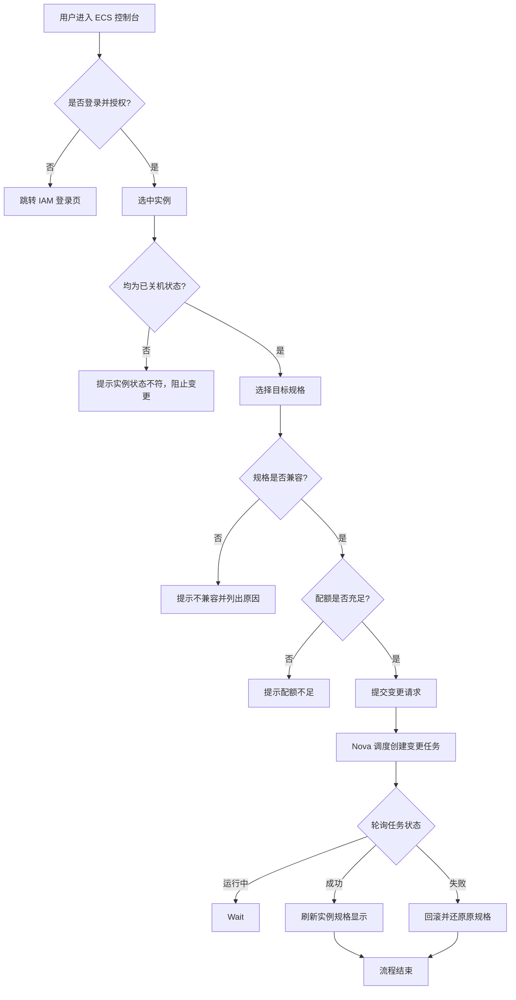
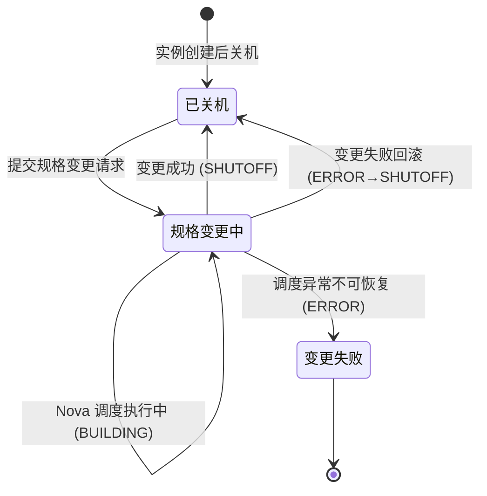

# 测试规格: [特性名称]

> **版本**: `[###-特性名称]`
> **创建日期**: [日期]
> **输入**: 用户描述："$ARGUMENTS"

---

## 第一章｜模板前置说明

### 【标准模板原文】

本模板是面向"功能测试"的标准规格说明文件（Function Test Specification），用于在需求/设计阶段对功能行为进行结构化定义与验收约束。其定位与约束如下：

1. **模板定位**：属于项目 `constitution.md` 定义体系下的二级测试文档，与性能、安全、可靠性等专项测试 Spec 并列，仅聚焦"功能行为与交互"测试。
2. **使用范围**：适用于新增功能、功能重构、跨模块交互调整等涉及**业务逻辑变更**的测试场景。不适用于纯 UI 美化、文案优化、基础设施升级等非功能变更。
3. **填写规则**：
   - 所有章节均不得留空；不适用的章节应显式填写"无"。
   - 所有表格必须逐行填写完整，不得合并单元格或遗漏必填列。
   - 使用统一的术语与对象命名，确保与需求文档、设计文档、代码命名一致。
   - 图表统一使用 Mermaid 语法绘制，避免引入外部图片或不可编辑图形。
   - 若某章节在编写过程中发现缺失或不适用，必须在本章"填写规则补充"中记录原因并经负责人确认。

### 【举例】

> 以下示例均基于"华为云 ECS 弹性云服务器批量规格变更"功能。

- **示例项目**：华为云 ECS 控制台"批量规格变更"功能——允许用户在控制台选中多台处于"已关机"状态的 ECS 实例并统一变更其规格（如 `s3.large` 变更为 `s3.xlarge`）。
- **使用范围示例**：适用于"批量规格变更"逻辑调整、规格兼容性校验规则变更、底层计算资源调度策略调整等涉及功能行为变化的场景。
- **不适用场景示例**：仅修改 ECS 控制台"规格变更"按钮颜色、调整页面提示文案等纯前端 UI 改动不强制使用本模板。
- **填写规则示例**：对象名统一使用华为云数据模型中定义的名称，如 `Instance.flavor`，而非前端展示的"云服务器规格"；优先级统一使用 P0～P3 四级。

---

## 第二章｜顶层宪章合规申明

### 【标准模板原文】

本 Spec 严格遵循项目 `constitution.md` 顶层宪章约束，所有测试相关动作必须满足以下法定要求：

1. **需求对齐原则**：本 Spec 所有内容 100% 对齐系统需求 Spec、系统架构 Spec 的功能逻辑、数据模型、交互规则；无本 Spec 依据的测试动作一律禁止，任何超出系统需求 Spec 与系统架构 Spec 范围的"额外测试"不得作为合入或放行依据。
2. **合规刚性原则**：所有测试验收标准完全符合绑定的 RFC 协议规范、行业标准，无合规缺口；验收判定不得以"项目自定义"为由降低或偏离已发布的 RFC/行业强制标准要求。
3. **全量追溯原则**：本 Spec 全生命周期操作可追溯、测试执行全流程数据可追溯、日志可追溯；从 Spec 编制、评审修改、测试执行、验收判定到最终合入，每一环节的操作人、操作时间、操作依据及输出产物均须留痕并可正向/反向查询。

### 【举例】

> 以下示例均基于"华为云 ECS 批量规格变更"功能。

- **需求对齐示例**："ECS 批量规格变更"功能中，Spec 定义的 `flavor` 变更校验逻辑必须与系统架构 Spec 中 `Instance.flavor` 数据模型定义完全一致；测试人员不得自行添加架构 Spec 中未定义的"规格标签颜色校验"验证动作。
- **合规刚性示例**：若绑定 RFC 7231（HTTP/1.1 语义规范），则 ECS 规格变更 API（`POST /v1/{project_id}/cloudservers/action`）返回的状态码必须严格按 RFC 定义校验（如 200 表示同步操作成功、202 表示异步任务已接受、400 表示客户端参数错误）；不得因"项目习惯"将 500 用于参数校验失败场景。
- **全量追溯示例**：测试人员执行 SC-03（规格不兼容异常场景）时，必须在测试管理系统中记录：操作人（张三）、执行时间（2025-05-07 14:30）、依据版本（Spec v1.2）、测试结果（通过）、底层 Nova 调度日志链接；后续审计可通过 SC-03 反向查找到全部执行日志与相关 Spec 版本变更历史。

---

## 第三章｜核心测试目标

### 【标准模板原文】

1. **对齐系统定义**：验证被测功能的对象属性、取值、处理流程、交互逻辑 100% 符合系统需求 Spec、系统架构 Spec 的定义，无逻辑偏差、无功能遗漏。
2. **全量场景覆盖**：全量覆盖本次需求的所有功能场景、流程分支、交互耦合场景，无测试盲区。
3. **继承性回归验证**：验证版本迭代的功能变更符合继承性要求，存量功能无劣化、新增功能无缺陷、历史问题无复现。
4. **合规与准入**：确保功能实现完全符合绑定的行业标准、合规规范要求，满足版本上线准入标准。

### 【举例】

> 以下示例均基于"华为云 ECS 批量规格变更"功能。

- **对齐示例**：`Instance.flavor` 的可变更规格范围、磁盘类型兼容性校验、规格变更任务的状态流转均与系统架构 Spec 数据模型和 Nova 调度接口契约完全一致，无任何自行扩展或缩减。
- **覆盖示例**：正常变更、规格不兼容拦截、实例运行中拦截、配额不足拦截、批量变更中部分失败回滚、并发变更冲突等全部场景和分支均已定义且 100% 执行，无遗漏。
- **回归示例**：本次批量变更逻辑调整后，回归验证"单台实例规格变更"、"实例创建时规格选择"等存量场景，确认无劣化；同时确认历史已知问题#ECS-8031（变更后 root 卷挂载丢失）未复现。
- **合规示例**：规格变更操作审计日志字段完整（`userId`、`projectId`、`instanceIds`、`oldFlavor`、`newFlavor`、`timestamp`），符合等保 2.0 三级安全审计要求；API 响应码严格遵循 RFC 7231 规范，满足华为云版本上线质量准入门槛。

---

## 第四章｜法定测试范围

### 【标准模板原文】

法定测试范围是本 Spec 的核心内容，包含以下四个子部分：

#### 4.1 功能应用场景定义

| 场景 ID | 场景名称 (正常/异常/边缘) | 前置条件 | 触发条件 | 优先级 |
|---------|---------------------------|----------|----------|--------|
|         |                           |          |          |        |

> 填写要求：场景名称需显式注明类型（正常/异常/边缘）；触发条件需可操作、可复现；优先级 P0 > P1 > P2 > P3。

#### 4.2 被测对象、属性与属性取值定义

| 编号 | 对象类型 | 对象名称 | 属性名称 | 数据类型 | 合法取值范围/枚举值 | 非法取值范围 | 优先级 |
|------|----------|----------|----------|----------|----------------------|----------------|--------|
|      |          |          |          |          |                      |                |        |

> 填写要求：对象名称须与数据模型或领域命名一致；数据类型需精确（如 `Decimal(10,2)` 而非 `数字`）；合法/非法取值必须互斥且覆盖全空间。

#### 4.3 测试操作定义

| 编号 | 操作类型 | 操作对象 | 操作动作 | 操作描述 |
|------|----------|----------|----------|----------|
|      |          |          |          |          |

> 填写要求：操作类型包括但不限于 `创建/查询/更新/删除/调用`；操作描述须包含输入参数、执行步骤及预期中间状态。

#### 4.4 功能处理流程定义

1. **业务主流程图**（正常流程），使用 Mermaid 流程图描述。
2. **异常分支流程列表**，包含：分支 ID、触发节点、触发条件、处理流程、优先级。
3. **核心状态机定义**，使用 Mermaid 状态图描述关键对象的状态迁移路径。

### 【举例】

> 以下示例均基于"华为云 ECS 批量规格变更"功能。

#### 4.1 功能应用场景定义（示例）

| 场景 ID | 场景名称 (类型)              | 前置条件                                       | 触发条件                                       | 优先级 |
|---------|------------------------------|------------------------------------------------|------------------------------------------------|--------|
| SC-01   | 单台实例规格变更（正常）      | 实例状态为"已关机"，目标规格可用且配额充足       | 用户选中单台实例并选择目标规格，确认变更        | P0     |
| SC-02   | 批量实例规格变更（正常）      | 所有选中实例状态为"已关机"，目标规格可用且配额充足 | 用户选中>=2 台实例并选择统一目标规格，确认变更  | P0     |
| SC-03   | 规格不兼容变更（异常）        | 实例挂载 GPU 卷，目标规格不支持该 GPU 类型       | 用户选择不兼容规格并提交变更                    | P1     |
| SC-04   | 运行中实例变更拦截（异常）    | 实例处于"运行中"状态                             | 用户选中最多台运行中实例并尝试变更规格          | P1     |
| SC-05   | 配额不足变更拦截（异常）      | 目标规格可用但用户配额已用尽                     | 用户选择目标规格并提交变更                      | P1     |
| SC-06   | 最大 vCPU 数变更（边缘）      | 实例配额剩余 64 vCPU，目标规格恰好为 64 vCPU      | 用户选择目标规格并提交变更                      | P2     |
| SC-07   | 配额超限变更拦截（边缘）      | 实例配额剩余 32 vCPU，目标规格为 64 vCPU          | 用户选择目标规格并提交变更                      | P2     |

#### 4.2 被测对象、属性与属性取值定义（示例）

| 编号 | 对象类型     | 对象名     | 属性名       | 数据类型         | 合法取值范围/枚举值                                     | 非法取值范围                        | 优先级 |
|------|--------------|------------|--------------|------------------|---------------------------------------------------------|-------------------------------------|--------|
| OP-01 | 云服务器实例| Instance   | status       | Enum/String      | `ACTIVE` / `SHUTOFF` / `BUILD` / `ERROR` / `REBOOT`      | 非以上枚举值                        | P0     |
| OP-02 | 云服务器实例| Instance   | flavor_id    | String (UUID)    | Nova 规格库中存在的有效 UUID                             | 空字符串、不存在规格 UUID 的 UUID     | P0     |
| OP-03 | 规格        | Flavor     | vcpus        | Integer          | 1 ~ 128                                                 | <=0 或 >128                          | P0     |
| OP-04 | 规格        | Flavor     | ram          | Integer (MB)     | 512 ~ 1048576                                           | <512 或 >1048576                     | P0     |

#### 4.3 测试操作定义（示例）

| 编号 | 操作类型 | 操作对象       | 操作动作                       | 操作描述                                                   |
|------|----------|----------------|--------------------------------|------------------------------------------------------------|
| ACT-01 | 更新    | Instance       | 提交规格变更请求               | 选中目标实例，选择新规格，点击"确认变更"按钮                |
| ACT-02 | 查询    | Task           | 查询变更任务状态               | 调用任务接口获取变更进度与结果                               |

#### 4.4 功能处理流程定义（示例）

**业务主流程图：**

**异常分支流程：**

| 分支 ID | 触发节点       | 触发条件                          | 处理流程                                          | 优先级 |
|---------|----------------|-----------------------------------|---------------------------------------------------|--------|
| EX-01   | StatusCheck    | 存在实例状态非 SHUTOFF            | 提示"仅支持已关机状态实例变更"，阻止提交          | P0     |
| EX-02   | CompatCheck    | 目标规格不兼容（如磁盘类型/GPU 类型冲突） | 提示不兼容原因并列出可用规格清单                | P1     |
| EX-03   | QuotaCheck     | 用户配额不足                      | 提示配额不足并引导进入配额申请页                  | P1     |
| EX-04   | NovaTask       | Nova 调度超时或失败               | 提示"调度失败，请稍后重试"，回滚已变更实例规格    | P1     |

**核心状态机（以 Instance 为例）：**

---

## 第五章｜功能交互与耦合关系定义

### 【标准模板原文】

本章节从外部交互与内部耦合两个维度，定义被测功能与其他模块/系统之间的协作关系，确保测试覆盖交互边界与耦合影响面。

#### 5.1 功能交互定义

从**外部视角**分析应用组合关系，明确功能之间的接口级交互行为：

| 交互ID | 交互类型 | 关系类型 | 交互双方 | 交互接口/协议 | 交互核心内容 | 优先级 |
|--------|----------|----------|----------|---------------|--------------|--------|
|        |          |          |          |               |              |        |

> 填写要求：
> - **交互类型**：`同步调用 / 异步消息 / 事件广播 / 轮询 / 回调` 等
> - **关系类型**：`依赖 / 被依赖 / 对等 / 聚合` 等
> - **交互双方**：明确主调方与被调方（如"ECS 控制台服务 → Nova 计算服务"）
> - **交互接口/协议**：具体接口名称或协议（如 `HTTP REST / gRPC / DMS Kafka / MySQL Binlog`）
> - **交互核心内容**：本次交互传递的核心数据或业务语义（如"规格变更请求/任务状态响应"）
> - **优先级**：P0 > P1 > P2 > P3

#### 5.2 功能耦合关系定义

从**内部视角**分析实现依赖关系，明确功能模块之间的代码级耦合约束：

| 耦合ID | 耦合对象名称 | 耦合类型 | 耦合强度 | 耦合影响范围 | 关系类型 | 测试要求 | 优先级 |
|--------|--------------|----------|----------|--------------|----------|----------|--------|
|        |              |          |          |              |          |          |        |

> 填写要求：
> - **耦合对象名称**：类名/模块名/服务名/组件名（如 `FlavorValidator`、`NovaClient`）
> - **耦合类型**：`代码引用 / 数据共享 / 状态共享 / 配置依赖 / 时序依赖` 等
> - **耦合强度**：`强耦合（不可独立部署/测试）/ 中耦合（可独立部署但需联合测试）/ 弱耦合（可独立部署/测试）`
> - **耦合影响范围**：耦合变更影响的范围描述（如"修改 FlavorValidator 的校验算法将影响实例创建/规格变更/热迁移三个模块"）
> - **关系类型**：`调用 / 被调用 / 共享 / 监听` 等
> - **测试要求**：针对该耦合关系需要执行的测试动作（如"独立部署验证 / 联合集成测试 / 模拟桩测试 / 契约测试"）
> - **优先级**：P0 > P1 > P2 > P3

### 【举例】

> 以下示例均基于"华为云 ECS 批量规格变更"功能。

#### 5.1 功能交互定义（示例）

| 交互ID | 交互类型 | 关系类型 | 交互双方 | 交互接口/协议 | 交互核心内容 | 优先级 |
|--------|----------|----------|----------|---------------|--------------|--------|
| IT-01  | 同步调用 | 依赖     | ECS 控制台服务 → Nova 计算服务   | HTTP REST: POST /v1/{project_id}/cloudservers/action | 规格变更请求提交 | P0     |
| IT-02  | 轮询     | 依赖     | ECS 控制台服务 → Nova 计算服务   | HTTP REST: GET /v1/{project_id}/jobs/{job_id}          | 变更任务状态轮询 | P0     |
| IT-03  | 同步调用 | 依赖     | ECS 控制台服务 → QUOTA 配额服务   | HTTP REST: POST /v1/{project_id}/quotas/validate       | 配额校验与扣减   | P0     |
| IT-04  | 事件广播 | 被依赖   | ECS 控制台服务 → CES 监控服务     | DMS Kafka Topic: ecs-flavor-change                   | 规格变更通知事件 | P1     |
| IT-05  | 同步调用 | 依赖     | ECS 控制台服务 → CTS 审计服务     | API: POST /v1/{project_id}/traces                     | 操作审计记录写入 | P1     |

#### 5.2 功能耦合关系定义（示例）

| 耦合ID | 耦合对象名称       | 耦合类型 | 耦合强度 | 耦合影响范围                                                     | 关系类型 | 测试要求                           | 优先级 |
|--------|--------------------|----------|----------|------------------------------------------------------------------|----------|------------------------------------|--------|
| CP-01  | FlavorValidator    | 代码引用 | 强耦合   | 修改规格校验算法将影响实例创建 / 规格变更 / 热迁移三个模块         | 调用     | 联合集成测试 + 回归测试            | P0     |
| CP-02  | NovaClient         | 代码引用 | 中耦合   | 封装 Nova API 调用逻辑，独立部署需确保 API 版本兼容                 | 调用     | 契约测试 + 模拟桩测试              | P0     |
| CP-03  | ResourceManager    | 数据共享 | 中耦合   | 共享 GaussDB 中的实例资源数据，独立部署需确保连接兼容               | 共享     | 独立部署验证 + 数据一致性测试      | P1     |
| CP-04  | ConfigLoader       | 配置依赖 | 弱耦合   | 依赖配置文件中的变更超时阈值参数，参数变更需重新加载                | 被调用   | 配置变更验证 + 热加载测试           | P2     |

---

## 第六章｜法定不测试范围

### 【标准模板原文】

本 Spec 仅覆盖"功能行为"测试范畴。以下范围明确排除在本次测试之外，对应的测试职责由专项测试 Spec 覆盖：

1. **性能维度**：包括但不限于接口响应时间、吞吐量、并发能力、压力极限测试。由《性能测试 Spec》覆盖。
2. **可靠性维度**：包括但不限于系统容灾、网络故障恢复、数据备份与恢复、长时间运行稳定性。由《可靠性测试 Spec》覆盖。
3. **安全维度**：包括但不限于越权访问、SQL 注入、XSS、CSRF、敏感数据泄露、权限绕过。由《安全测试 Spec》覆盖。
4. **兼容性维度**：包括但不限于跨浏览器、跨操作系统、跨设备分辨率、移动端 OS 版本。由《兼容性测试 Spec》覆盖。
5. **UI 与视觉维度**：颜色、字体、布局、动效、图标等前端视觉表现。由 UI/UX 验收规范覆盖。
6. **其他**：任何未在本 Spec"法定测试范围"中明确列出的场景、对象、操作或流程。

### 【举例】

> 以下示例均基于"华为云 ECS 批量规格变更"功能。

- **性能排除示例**：本 Spec 不测试"在 100 QPS 批量变更请求下 Nova 接口响应时间 <2s"；该指标由专项性能测试 Spec 覆盖。
- **可靠性排除示例**：本 Spec 不测试"在 Nova 组件故障恢复期间批量变更请求的自动重试与最终一致性"；该由可靠性测试 Spec 覆盖。
- **安全排除示例**：本 Spec 不测试"非租户用户能否通过篡改 project_id 请求参数操作他人 ECS 实例"；该由安全渗透测试 Spec 覆盖。
- **兼容性排除示例**：本 Spec 不验证"ECS 控制台规格变更页在 Chrome 与 Firefox 中布局是否一致"；由前端兼容性测试 Spec 覆盖。

---

## 第七章｜刚性验收标准

### 【标准模板原文】

本 Spec 的验收标准为"必须通过"的刚性条款，任一未通过项均视为验收失败。验收标准包括但不限于以下五类：

#### 7.1 被测对象与属性验收标准

- 所有被测对象的属性合法取值范围必须被严格校验；任何超出定义范围的值不得被系统接受或持久化。
- 属性类型转换、精度丢失、舍入误差必须在定义范围内，并在异常时抛出明确错误提示。

#### 7.2 功能场景与处理流程覆盖验收标准

- 所有定义的测试场景（正常/异常/边界）必须 100% 执行并记录结果。
- 处理流程（主流程与异常分支）中的每个节点行为必须与 Spec 定义一致。

#### 7.3 功能交互与耦合验收标准

- 本功能与其他模块/服务的交互行为必须符合契约定义。
- 模块间状态同步、数据一致性、并发操作冲突必须被正确识别与处理。

#### 7.4 继承性回归验收标准

- 本 Spec 覆盖的功能变更若影响已有功能，必须对相关历史功能进行回归验证。
- 回归范围由变更影响分析确定，并在本 Spec 中明确列出需回归的场景 ID 列表。

#### 7.5 合规验收标准

- 功能必须符合项目宪章、业务合规要求、数据保护法规及行业审计要求。
- 任何涉及用户隐私、资金、权限的操作必须具备完整的审计日志。

### 【举例】

> 以下示例均基于"华为云 ECS 批量规格变更"功能。

#### 7.1 被测对象与属性验收标准（示例）

- `Instance.flavor_id` 输入为不存在的 UUID 时，必须提示"规格不存在"并拒绝创建变更任务。
- `Flavor.vcpus` 在输入值为 0 时，必须提示"vCPU 数必须大于 0"并拦截。

#### 7.2 功能场景与处理流程覆盖验收标准（示例）

- 若共定义 12 个场景（SC-01~SC-12），必须全部执行并输出测试报告；缺少任一场景视为验收不通过。
- 主流程中的"Nova 调度变更任务"与"刷新实例规格显示"必须顺序执行；若前端先刷新规格显示但 Nova 任务尚未成功完成，视为流程不一致。

#### 7.3 功能交互与耦合验收标准（示例）

- ECS 控制台服务向 Nova 提交规格变更请求后，Nova 回任务状态必须与变更结果一致；若 Nova 任务已成功但控制台仍显示"变更中"，视为严重 Bug。
- 当同一用户同时通过控制台与 OpenAPI 发起规格变更请求时，必须采用串行化处理或冲突检测机制，不得对同一实例执行并发变更。

#### 7.4 继承性回归验收标准（示例）

- 因本次批量变更逻辑调整，需回归验证以下历史场景："单台实例规格变更功能"、"实例创建时规格选择"、"变更任务异常通知邮件"。
- 回归场景 ID 列表：SC-202、SC-203、SC-210。

#### 7.5 合规验收标准（示例）

- 所有规格变更操作必须写入 CTS 审计日志，包含 `userId`、`projectId`、`instanceIds`、`oldFlavor`、`newFlavor`、`timestamp`、`operationSource`，不可遗漏。
- 若涉及计费规格变更，必须同步触发 BSS 计费引擎的计费项更新，且变更前后计费金额可审计、不可篡改。
