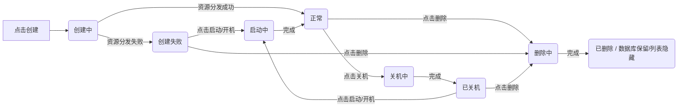

# Lee云平台 需求规格说明书

**需求编号**: 007-LECS主机
**创建日期**: 2026-05-08
**状态**: 草稿
**需求描述**: "LECS主机（云服务器）功能开发：支持在控制台搜索、列表查看、创建、开关机控制及删除操作，前端页面风格与控制台保持一致"

---

## 一、业务背景与目标

### 1.1 业务背景
Lee云平台作为云计算服务平台，需要提供基础的云服务器（LECS主机）管理能力，让用户能够创建、管理、控制和运维虚拟计算实例。核心是提供完整的生命周期控制能力（创建-运行-停止-删除），帮助用户灵活管理和维护计算资源。

### 1.2 业务目标
- 提供云服务器的创建、查询、开关机及删除的全流程管理功能。
- **支持生命周期控制**：允许用户通过列表操作列对主机进行**关机**（释放资源）与**开机**（恢复服务）操作，实现按量计费场景下的成本控制。
- 提供直观的云资源配置界面，支持多种实例规格、操作系统与网络配置选择。
- 严格的前端操作权限控制：根据主机状态动态渲染操作列按钮（置灰/高亮），防止并发冲突与误操作。

### 1.3 范围界定
- **包含**: 控制台搜索集成、LECS主机列表页（含完整操作矩阵与状态流转）、LECS主机创建页（含基础配置、实例、操作系统、IP配置、购买时长、费用确认）、后端基础API接口（查询、创建、关机、开机、删除）。
- **不包含**: 主机重启操作、控制台VNC登录、安全组配置、弹性IP管理、数据盘挂载、快照备份、批量操作、主机标签管理、区域切换功能。

---

## 二、用户场景与验收 *(必填)*

### 用户故事 1 - 在控制台搜索并跳转至LECS主机列表页 (优先级: P1)

用户登录Lee云平台控制台后，在顶部搜索栏输入"LECS主机"或"云服务器"，搜索结果中智能匹配出"LECS主机"条目，点击后直接跳转至LECS主机列表页。

**优先级理由**: 这是用户访问LECS主机功能的唯一入口，决定了后续所有操作的可发现性。

**独立可测**: 可通过在搜索栏输入关键词验证高亮匹配与路由跳转。
**验收场景**:
1. **前提**: 用户已登录，**操作**: 搜索"LECS"或"云服"，**预期**: 下拉结果出现"LECS主机"，关键词高亮。
2. **前提**: 点击搜索结果，**操作**: 鼠标点击条目，**预期**: 浏览器地址栏变为 `/console/lecs-hosts/list`，页面正常加载。

---

### 用户故事 2 - 查看 LECS 主机列表与操作矩阵 (优先级: P1)

用户进入列表页后，查看主机数据表格。列表包含主机名/ID、计费模式、运行状态（彩色标签区分）、私有IP、操作列。**列表页无全局工具栏**，标题右侧仅显示"创建ECS主机"按钮。
**注意**：**已删除**主机在数据库中仅置为已删除状态（Soft Delete），**不显示在主机列表中**。
操作列包含**关机**、**启动**、**删除**三个按钮。按钮的可用性严格遵循状态机：当前状态不支持的操作按钮自动置灰不可点击。

**优先级理由**: 列表页是资源管理的控制台，状态可视化和精准的权限控制是运维安全的基础。

**独立可测**: 创建不同状态的主机（正常、创建中、已关机、删除中等），验证状态标签渲染与操作列按钮的置灰逻辑及删除主机的列表隐藏效果。
**验收场景**:
1. **前提**: 列表页有数据，**操作**: 查看右侧操作列，**预期**: 每行均显示"关机"、"启动"、"删除"按钮。
2. **前提**: 主机状态为"正常"，**操作**: 查看操作列，**预期**: "关机"按钮可点击；"启动"、"删除"按钮置灰不可用。
3. **前提**: 主机状态为"已关机"，**操作**: 查看操作列，**预期**: "启动"、"删除"按钮可点击；"关机"按钮置灰。
4. **前提**: 主机状态为"创建失败"，**操作**: 查看操作列，**预期**: 仅"删除"按钮可点击；其余置灰。
5. **前提**: 主机正在"删除中"，**操作**: 查看操作列，**预期**: 状态标签显示"删除中"，操作列所有按钮置灰。
6. **前提**: 用户删除一台主机，**操作**: 刷新列表页，**预期**: 该主机记录在列表中消失（数据库中状态已置为已删除）。

---

### 用户故事 3 - 创建 LECS 主机 (优先级: P2)

用户在 LECS 主机列表页点击"创建 ECS 主机"按钮，进入创建页。依次配置以下信息，确认费用后提交。提交后前端立即跳转列表页（显示"创建中"），后台在 30 秒内完成资源分发，最终状态变为"正常"或"创建失败"。

- **基础配置**:
  - **计费模式**: 分"包年/包月"、"按需计费"，单选。
  - **主机名**: 输入框，支持英文、数字、下划线，长度4-10字符，不支持下划线开头。
  - **访问凭证**: 用户名、密码输入框。用户名支持英文、数字、特殊字符，长度4-16字符；密码支持英文、数字、特殊字符，长度8-32字符。
  - **校验**: 当任一输入框不满足要求时提示错误。
- **实例配置**:
  - **实例类型**: 分"经济型"、"高性能型"，单选。
  - **具体规格**:
    - **经济型**: 通用计算机 - 2vCPUs - 2GiB内存 - 40G系统盘 (100元/月)，2vCPUs - 4GiB内存 - 40G系统盘 (140元/月)，2vCPUs - 8GiB内存 - 40G系统盘 (180元/月)，4vCPUs - 8GiB内存 - 40G系统盘 (240元/月)。
    - **高性能型**: 通用增强计算机 - 2vCPUs - 4GiB内存 - 40G系统盘 (160元/月)，2vCPUs - 8GiB内存 - 40G系统盘 (200元/月)，4vCPUs - 8GiB内存 - 40G系统盘 (260元/月)，8vCPUs - 16GiB内存 - 40G系统盘 (500元/月)。
    - **校验**: 具体规格必须选，未选时提示错误。
- **操作系统**:
  - **镜像**: 下拉可选 "Huawei Euler OS"、"Ubuntu"、"Windows"，默认选择 "Huawei Euler OS"。
- **IP配置**:
  - **分配方式**: 分 "DHCP 分配"、"手工配置"，单选。
  - **DHCP**: 无需额外配置。
  - **手工配置**: 显示 "IP地址" 输入框和 "掩码数值" 下拉框。IP需满足正确格式，否则报错；掩码可选 8-24 之间正整数。
- **购买时长**:
  - 分 1-9个月、1年、2年，单选。
- **配置费用**:
  - **包年/包月**: 费用 = 实例规格费用 * 购买月份，单位 "/月"。
  - **按需计费**: 费用 = 实例规格费用 / 30，单位 "/天"。
- **立即购买**:
  - 点击后弹出窗口展示用户的所有选择结果，提供"取消"、"确定"按钮。点击"取消"退出弹窗，点击"确定"则提交创建。

**优先级理由**: 资源交付的核心路径，配置复杂度与费用计算的准确性直接影响用户转化。

**独立可测**: 完整填写表单，拦截错误校验，验证弹窗内容完整性，验证列表页状态异步刷新。
**验收场景**:
1. **前提**: 用户在列表页，**操作**: 点击"创建ECS主机"，**预期**: 进入创建页，显示基础配置等六大核心板块、购买时长及费用显示栏。
2. **前提**: 点击立即购买并校验通过，**操作**: 弹窗展示配置清单（含时长费用），**预期**: 点击确定后，主机数量配额检查通过，跳转列表页并显示新主机状态为"创建中"。

---

### 用户故事 4 - 控制主机生命周期（关机/开机）(优先级: P3)

用户在 LECS 主机列表页的"操作"列中，根据主机当前状态点击"关机"或"开机"按钮。
- **关机逻辑**：当主机处于"正常"运行状态时，点击"关机"触发请求。主机状态立即变更为 **"关机中"**。后台处理资源释放（预计耗时 **10秒**）。完成后，状态变为 **"已关机"**，此时列表显示"关机"置灰，"启动"高亮。
- **开机逻辑**：当主机处于"已关机"或"创建失败"时，点击"启动"触发请求。主机状态变更为 **"启动中"**。后台处理资源启动（预计耗时 **10秒**）。完成后，状态变为 **"正常"**，此时列表显示"启动"置灰，"关机"高亮。
- **防呆机制**：当主机处于"创建中"、"关机中"、"启动中"、"删除中"等任何中间过渡状态时，操作列中的所有功能按钮（关机、启动、删除）均**置灰不可点击**，防止并发指令冲突。

**优先级理由**: 提供主机的状态控制能力，允许用户根据业务需求临时停止服务（停机保号/停费）或从故障中恢复。

**独立可测**: 覆盖 正常→关机中→已关机→启动中→正常 的完整状态机流转，验证异步耗时与防冲突逻辑。
**验收场景**:
1. **前提**: 主机状态为"正常"，**操作**: 点击操作列"关机"，**预期**: 按钮立即置灰，状态变更为"关机中"。10秒后状态变为"已关机"，"启动"按钮恢复可用。
2. **前提**: 主机状态为"已关机"，**操作**: 点击"启动"，**预期**: 按钮立即置灰，状态变更为"启动中"。10秒后状态变为"正常"，"关机"按钮恢复可用。
3. **前提**: 主机处于"关机中"过渡态，**操作**: 再次点击"关机"或"启动"，**预期**: 按钮呈置灰失效态，后端拒绝重复请求。

---

### 用户故事 5 - 安全的主机删除操作 (优先级: P4)

用户在 LECS 主机列表页对特定主机执行删除操作。删除操作受到**严格的状态限制与异步流转机制**：仅当主机完全静止（**已关机**）或资源分配异常（**创建失败**）时才允许执行。
**软删除说明**：点击"删除"后，主机状态变更为 **"删除中"**。后台执行逻辑删除（Soft Delete）及配额释放（预计耗时 2~5 秒）。完成后，数据库中该主机状态置为 **"已删除"**，但在**前端主机列表页中不再显示**（被过滤隐藏）。
配额计数 -1。

**优先级理由**: 完成主机生命周期的闭环。限制运行态删除是防止数据丢失与资源泄露的关键策略；异步删除机制确保前端体验流畅且状态最终一致。

**独立可测**: 验证正常态拦截删除、已关机态触发异步删除并成功释放配额。
**验收场景**:
1. **前提**: 主机状态为"正常"、"创建中"或"关机中"，**操作**: 查看操作列"删除"按钮，**预期**: 按钮置灰，或点击时拦截提示"**请先将主机关机，再执行删除操作**"，阻止提交。
2. **前提**: 主机状态为"已关机"或"创建失败"，**操作**: 点击"删除"，**预期**: 弹出二次确认框。确认后，该主机状态立即变为"删除中"，操作列按钮全部置灰。约 3~5 秒后，该行从列表中彻底消失，顶部配额计数减少 1。

---

### 边界场景与异常处理 (核心)
- **配额限制**：用户持有的主机总数（**包含所有未软删除记录**，即正常、关机中、已关机、创建失败、删除中均计入）达到 **100 台** 时，阻断创建请求并提示"主机数量达到上限"。
- **超时降级**：若后台创建任务超时（> 60s），强制将主机状态降级为 **"创建失败"**，并停止前端轮询，避免主机卡在"创建中"死循环。
- **并发锁**：列表页正在执行异步操作（如关机中、删除中）时，该行操作列按钮严格处于 **Disabled** 状态，禁止任何点击。
- **网络断连**：断网期间产生的操作，在网络恢复后应触发列表页的全量刷新（Refetch），确保显示状态与数据库强一致。

---

## 三、前端需求

### 3.1 页面结构

| 页面名称 | 路由路径 | 页面描述 | 权限要求 |
|---------|---------|---------|---------|
| LECS 主机列表页 | `/console/lecs-hosts/list` | 右置"创建ECS主机"按钮；主体为数据表格，严格按状态机控制操作列（关机/启动/删除）按钮的置灰与可用逻辑。 | 登录用户 |
| LECS 主机创建页 | `/console/lecs-hosts/create` | 创建流程：基础配置、实例、操作系统、IP配置、购买时长、费用确认与弹窗提交。 | 登录用户 |

### 3.2 交互组件标识（data-testid 规范）

> 根据项目宪法，所有可交互组件必须添加 `data-testid` 属性。

**LECS 主机列表页**:

| 页面/模块 | 组件类型 | data-testid | 说明 |
|----------|---------|------------|------|
| lecs-host-list | table | `lecs-host-data-table` | 主机数据表格 |
| lecs-host-list | button | `lecs-host-create-button` | 创建 ECS 主机按钮 |
| lecs-host-list | row-status | `lecs-host-status-{id}` | 状态标签（正常/关机中/已关机/删除中等） |
| lecs-host-list | row-action | `lecs-host-action-shutdown` | 操作列-关机按钮 |
| lecs-host-list | row-action | `lecs-host-action-start` | 操作列-启动按钮 |
| lecs-host-list | row-action | `lecs-host-action-delete` | 操作列-删除按钮 |

**LECS 主机创建页**:

| 页面/模块 | 组件类型 | data-testid | 说明 |
|----------|---------|------------|------|
| lecs-host-create | radio-group | `lecs-billing-mode` | 计费模式选择 |
| lecs-host-create | input | `lecs-hostname-input` | 主机名输入框 |
| lecs-host-create | input | `lecs-username-input` | 访问凭据用户名 |
| lecs-host-create | input | `lecs-password-input` | 访问凭据密码 |
| lecs-host-create | radio-group | `lecs-instance-type-tabs` | 实例类型（经济型/高性能型） |
| lecs-host-create | card | `lecs-instance-card-{id}` | 具体实例规格卡片 |
| lecs-host-create | select | `lecs-os-image-selector` | 操作系统镜像下拉 |
| lecs-host-create | radio-group | `lecs-ip-mode-tabs` | IP分配方式 |
| lecs-host-create | input | `lecs-ip-address-input` | 手工配置IP地址输入框 |
| lecs-host-create | select | `lecs-ip-mask-selector` | 掩码下拉框 (8-24) |
| lecs-host-create | radio-group | `lecs-duration-selector` | 购买时长选择 (1-9月/1年/2年) |
| lecs-host-create | price-display | `lecs-config-price` | 配置费用显示 |
| lecs-host-create | button | `lecs-buy-submit-button` | 立即购买按钮 |
| lecs-host-create | dialog | `lecs-confirm-dialog` | 配置确认弹窗 |
| lecs-host-create | button | `lecs-confirm-cancel-btn` | 确认弹窗-取消按钮 |
| lecs-host-create | button | `lecs-confirm-ok-btn` | 确认弹窗-确定按钮 |
| lecs-host-create | button | `lecs-confirm-cancel-btn` | 确认弹窗-取消按钮 |
| lecs-host-create | button | `lecs-confirm-ok-btn` | 确认弹窗-确定按钮 |

**命名规则**: 格式：`[功能模块]-[操作]-[元素类型]`，小写英文，连字符分隔。

### 3.3 状态与交互要求
- **列表轮询机制**: 当列表中存在 `creating`, `shutting_down`, `starting`, `deleting` 状态时，前端启动 **3秒/次** 轮询。状态变为终态后停止轮询。
- **置灰交互**: 使用 CSS class `.disabled` 或 HTML `disabled` 属性。置灰时禁用点击事件，不发起网络请求。

### 3.4 响应式要求
- 桌面端适配要求：1280px 及以上全功能展示。暂不支持平板端和移动端适配。

---

## 四、后端需求

### 4.1 API 接口

| 接口名称 | 方法 | 路径 | 描述 | 权限/状态校验 |
|---------|---------|---------|------|------|
| 查询列表 | GET | `/api/v1/lecs-hosts` | 分页查询，过滤已删除 | - |
| 创建主机 | POST | `/api/v1/lecs-hosts` | 异步创建，30s 超时 | 配额校验 ≤100 |
| **关机** | POST | `/api/v1/lecs-hosts/{id}/shutdown` | **异步关机，10s 耗时** | 当前状态 **必须为 normal** |
| **启动** | POST | `/api/v1/lecs-hosts/{id}/start` | **异步启动，10s 耗时** | 当前状态 **必须为 stopped / failed** |
| **删除** | DELETE | `/api/v1/lecs-hosts/{id}` | **逻辑删除** | 当前状态 **必须为 stopped / failed** |

### 4.2 接口请求/响应 (核心摘要)

#### 4.2.1 创建LECS主机
- **Body**: `hostname`, `billing_mode`, `instance_type`, `spec_id`, `os_image`, `ip_mode`, `ip_address`, `ip_mask`, `duration`
- **响应 (201)**: `{ "id": "UUID", "status": "creating", "message": "任务已提交" }`

#### 4.2.2 关机接口
- **前置校验**: `if status != 'normal' return 409;`
- **响应 (200)**: `{ "status": "shutting_down", "message": "关机指令已下发" }`

#### 4.2.3 启动接口
- **前置校验**: `if status not in ['stopped', 'failed'] return 409;`
- **响应 (200)**: `{ "status": "starting", "message": "启动指令已下发" }`

#### 4.2.4 删除接口
- **前置校验**: `if status not in ['stopped', 'failed'] return 403;`
- **响应 (202)**: `{ "status": "deleting", "message": "删除中，请等待处理完成" }`
- **失败 (403)**: `{ "code": "NOT_STOPPED", "message": "仅支持对已关机或创建失败的主机执行删除" }`

### 4.3 数据模型 (LECSHost)

| 字段名 | 类型 | 约束 | 说明 |
|-------|------|------|------|
| id | UUID | PK | 主机唯一标识 |
| user_id | UUID | FK, INDEX | 所属用户 |
| hostname | String(10) | NOT NULL | 主机名称（英文/数字/下划线） |
| status | Enum | NOT NULL | **状态机核心**：`creating`, `normal`, `failed`, `shutting_down`, `stopped`, `starting`, `deleting`, `deleted`（数据库中保留，列表隐藏） |
| deleted_at | DateTime | Nullable | 软删除时间 (IS NULL 表示未删除，占用配额；IS NOT NULL 表示已删除，列表不显示) |
| duration | Integer | Nullable | 购买时长（月），如 6, 12, 24 |
| cost_info | JSON | Nullable | 存储费用快照（单价、计费模式、总价） |
| error_msg | Text | Nullable | 创建/删除失败时的错误堆栈或原因 |
| created_at / updated_at | DateTime | Default | 时间戳 |

---

## 五、业务规则 (核心)

## 5.1 核心功能要求
- **规则 1**: 列表页操作列的按钮可用性 **MUST** 严格遵循状态机矩阵，非匹配状态一律置灰。
- **规则 2**: DELETE 接口 **MUST** 强校验主机状态，拒绝 `normal`/`creating` 等运行态的删除请求。
- **规则 3**: 100 台配额统计范围为 **所有 `deleted_at IS NULL` 的记录**。
- **规则 4**: 关机/启动/删除操作 MUST 为异步处理，先写过渡态 (`shutting_down`/`starting`/`deleting`)，待 Worker 执行完成后回调更新为终态。

### 5.2 数据校验规则 (VR)

| 编号 | 规则描述 | 触发时机 | 处理策略 |
|------|---------|---------|---------|
| VR-001 | 主机名正则校验 (^[\w]{4,10}$, 拒 `_` 开头) | 创建页输入时 | 实时红字提示 |
| VR-002 | 凭据复杂度校验 (用户名4-16, 密码8-32) | 创建页输入时 | 实时红字提示 |
| VR-003 | 购买时长枚举校验 (1-9, 12, 24) | 创建页选择时 | 拦截非法值 |
| VR-004 | **状态机拦截** | 点击操作列按钮时 | 若状态不匹配（如正常态点删除），前端直接拦截，不发起网络请求 |
| VR-005 | **配额上限校验** (≤100) | 点击"立即购买-确定"时 | 拦截并Toast提示"主机数量达到上限" |

### 5.3 权限规则
- **管理员**: 管理所有LECS主机，可查询、创建、删除、开关机。
- **普通用户**: 仅管理自己的LECS主机。查询列表（仅自己）、创建（自己的）、删除（自己的）、开关机（自己的）。只能操作自己拥有的主机。

### 5.4 安全要求
- **身份认证**: JWT Cookie 认证，Token 有效期内，复用现有认证机制。
- **数据保护**: 敏感信息（如IP配置、密码哈希）需要加密存储，日志脱敏。
- **接口安全**: 复用现有 CSRF 保护和 API 限速机制。
- **日志审计**: 所有LECS主机的创建、删除、开机、关机操作必须记录操作日志，包含操作人、操作时间、IP地址、操作详情。

---

## 六、数据流向与集成

### 6.1 数据流向 (完整状态机)

### 6.2 外部依赖
| 依赖项 | 类型 | 用途 | 失败处理 |
|-------|------|------|---------|
| 现有认证系统 | 内部模块 | JWT Token 验证 | 未认证/Token 失效时重定向至登录页 |
| 实例规格数据源 | 内部数据 | 提供实例规格配置信息（vCPU、内存、磁盘、价格） | 加载失败时显示错误提示，禁用提交 |
| 操作系统镜像数据源 | 内部数据 | 提供操作系统镜像列表 | 加载失败时显示错误提示，禁用提交 |
| 配额系统 | 内部模块 | 校验用户可创建的主机数量上限 | 配额校验失败时提示用户 |
| 异步任务队列 (Celery/RQ) | 基础设施 | 用于处理 30s 创建、10s 关机/启动、5s 删除的重载任务 | 重试或降级为失败 |

---

## 七、成功标准 *(必填)*

### 可衡量指标
- **成功标准 1**: 用户在控制台搜索栏输入"LECS主机"后，可在 1 秒内看到匹配结果并点击跳转。
- **成功标准 2**: LECS主机列表页加载完成（包含状态数据和操作列）时间不超过 2 秒。
- **成功标准 3**: 列表页状态流转准确率 100%，无卡顿或状态不同步。
- **成功标准 4**: 操作列按钮置灰逻辑与状态机矩阵匹配度 100%，无误触。
- **成功标准 5**: 后端 DELETE 接口对运行态主机的拦截成功率 100% (返回 403)。
- **成功标准 6**: 所有可交互组件 100% `data-testid` 覆盖。

---

## 八、假设与约束
- v1.0 仅支持"关机/启动"，暂不支持"重启"（重启 = 关机+启动的组合）。
- 关机/启动由底层 Hypervisor 负责，API 层仅做指令下发。
- 创建、关机、启动、删除等异步操作依赖消息队列保证最终一致性。
- 计费逻辑由后端计算并返回，前端仅做展示。

---

## 九、需求变更与已决事项

### 9.1 已确认项 [CONFIRMED]

以下事项经评审已明确，作为 v1.0 的最终执行标准：

1.  **费用展示逻辑**:
    *   **决定**: 弹窗中的预估费用由**前端**根据"实例单价 × 购买时长"实时计算展示；实际扣费以**后端**创建订单生成的最终账单为准。
2.  **停机计费策略 (按需模式)**:
    *   **决定**: 主机处于 **"已关机"** 状态时，**释放计算资源（CPU/内存）并停止计费**；但**保留存储资源（磁盘/镜像）继续收取存储费用**。
    *   *注：创建页需补充展示提示（如"关机将释放计算资源，停止计算计费，但磁盘仍会产生费用"）。*
3.  **访问凭据密码策略**:
    *   **决定**: 维持现有规则（英文、数字、特殊字符组合，长度 8-32 位），**不强制要求**"必须同时包含大小写字母"，以降低用户使用门槛。

### 9.2 历史变更追溯
*   **v1.0 (25-05-08)**: 增加 `deleting` 和 `deleted` 状态（软删除）。
*   **v1.1 (25-05-08)**: 确认前端负责费用计算；确认停机释放计算资源计费规则；确认密码强度维持现状。

---

## 附录
- **A. 术语表**: LECS主机, 状态机, 软删除, 配额锁定。
- **B. 参考资料**: 状态矩阵图, 截图参考文件夹。
- **C. 变更历史**:
  - v1.0 (25-05-08): 初始需求确认。
  - v1.1 (25-05-08): 完善第九章已决事项，明确计费与停机扣费规则。