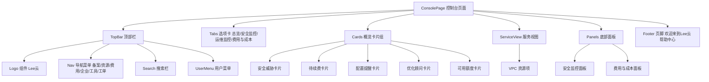

# Research & 技术决策: 控制台页面创建与品牌替换

> **Feature**: specs/001-console-page-lee  
> **Phase**: Phase 0 -- 大纲与研究  
> **Date**: 2026-05-08

---

## 研究概览

本文件记录 `/speckit-test.plan` 规划阶段对技术选型、测试工具链和风险分析的研究成果。所有 NECESSARY CLARIFICATION 均已在本文件中解析。

---

## 决策 01: 前端框架选型

**Decision**: 待开发阶段由产品/架构团队确定（Vue.js / React / 原生 HTML+CSS/ 等）。

**Rationale**: 本项目为从零开始的全新项目，不存在已有技术栈约束。前端框架选择取决于：
1. 团队技术背景与学习成本
2. 项目复杂度与性能需求（控制台页面为 Dashboard 类应用，组件较多）
3. 生态系统成熟度（组件库、状态管理、路由）

**待确定后的测试影响**:
- **Vue.js**: 推荐使用 `@vue/test-utils` + `vitest` + `Playwright`
- **React**: 推荐使用 `@testing-library/react` + `jest` + `Playwright` + `@testing-library/user-event`
- **原生 HTML/CSS/JS**: 直接使用 `Jest` + `Playwright` 进行 DOM 测试

**Alternatives considered**:
- 无框架/原生 JS — 适合简单页面但维护成本高
- Vue vs React — 两者生态都成熟，Vue 对中国团队更友好，React 国际化更好

---

## 决策 02: E2E 测试工具选型

**Decision**: Playwright（待框架选定后确认最终组合）

**Rationale**: Playwright 是微软开源的跨浏览器端到端测试框架，相比 Cypress 和 Selenium 具有以下优势：
1. 跨浏览器支持（Chromium、Firefox、WebKit）
2. 自动等待机制，减少 flaky test
3. 截图/视频录制、网络拦截、Mock 能力
4. 代码生成器可直接录制操作生成测试代码
5. 与 CI/CD 集成顺畅

**应用场景**:
- SC-01 控制台页面渲染验证（页面加载 + 组件存在性）
- SC-02 管理员登录（输入 admin/admin@123 + 提交）
- SC-03 登录成功跳转（URL 变为 /console + 页面内容切换）
- SC-04 错误凭证测试（输入错误密码 → 停留在登录页）
- SC-08 未授权拦截（直接访问 /console → 重定向到登录页）
- SC-09 控制台搜索功能（输入关键词 → 验证结果加载）
- SC-10 导航菜单交互（点击菜单项 → 子页面加载）

**Alternatives considered**:
- **Cypress**: 仅支持 Chrome/Firefox，Mock 能力稍弱，但对中国团队文档更友好
- **Selenium**: 生态最老但架构陈旧，flaky test 较多，不推荐新项目

---

## 决策 03: 单元测试框架选型

**Decision**: Jest 或 Vitest（取决于前端框架）

**Rationale**: 
- 如果选择 **React**: Jest + `@testing-library/react` 是行业标准
- 如果选择 **Vue 3** + `Vite`: Vitest 是首选，速度快且与 Vite 原生集成
- 如果选择 **原生 JS**: Jest 足够覆盖 DOM 操作和逻辑测试

**应用场景**:
- 登录表单验证逻辑（空输入拦截、密码格式校验）
- 路由守卫逻辑（认证状态判断、重定向逻辑）
- 品牌文案替换工具函数（递归替换、边界情况处理）

**Alternatives considered**:
- **Mocha + Chai**: 灵活但配置复杂，新项目不如 Jest/Vitest 开箱即用
- **Jasmine**: 已逐渐被淘汰

---

## 决策 04: 品牌替换策略

**Decision**: 采用全局常量/配置文件统一管理品牌文本，而非硬编码在代码中

**Rationale**: 品牌替换（"华为云" → "Lee云"）涉及的 UI 区域较多（Logo、标题、搜索提示、页脚、文档入口等）。如果硬编码在各处，后续品牌变更时需要逐行修改，容易遗漏。采用全局配置方案：
1. 定义 `src/config/brand.ts`（或 `brand.config.js`） 文件
2. 所有品牌文案从该文件引用
3. 测试时只需验证配置文件值正确 + 页面中引用该配置的位置正确渲染

**测试验证方法**:
- 自动化：全局搜索项目源代码（排除 `brand.ts` 本身）是否存在 "华为云" 字符串
- 人工：按附录对照清单逐项检查各 UI 区域

**Alternatives considered**:
- 直接使用 AST 替换工具批量替换所有源码中的"华为云"→ "Lee云" — 但后续维护困难
- 使用 i18n 国际化方案管理品牌文案 — 过度设计，当前不需要多语言支持

---

## 决策 05: 管理员初始账号创建方案

**Decision**: 系统启动时通过初始化脚本/种子数据创建 admin/admin@123 账号，并在首次登录后标记为"需修改密码"

**Rationale**:
- 初始账号密码是系统初始化的必要环节
- admin/admin@123 是弱口令，首次登录后必须强制要求修改（SC-07/P2）
- 需要在用户数据模型中添加 `firstLogin` 或 `passwordChanged` 字段来追踪状态

**测试验证方法**:
- 验证系统启动后数据库/存储中存在 admin 用户记录
- 验证使用 admin/admin@123 登录成功
- 验证首次登录时触发密码修改流程
- 验证修改密码后 `firstLogin` 标志位为 `false`

---

## 决策 06: 控制台页面组件结构

**Decision**: 参照 `screanshots/华为云控制台.png` 的设计稿，分解为以下组件层级：

**测试验证方法**:
- Playwright E2E 测试验证每个关键组件是否存在（通过 element selector 检查 DOM 元素）
- 不验证像素级样式（颜色、间距、字体），仅验证明/组件存在性和可访问性

---

## 决策 07: 测试环境要求

**Decision**: 需要提供可运行测试的本地/CI 环境

**Requirement**:
- Node.js ≥ 16（现代前端工具链要求）
- Chrome/Chromium 浏览器（Playwright 依赖）
- 前端应用启动后，测试可在 `localhost:{port}` 上运行

**Alternatives considered**:
- 使用 Docker 容器化环境 -- 可作为 CI 阶段的备选方案
- Mock 后端服务 -- 当前阶段可先用前端 Mock，后续切换为真实后端

---

## 决策 08: 风险分析

| 风险 | 影响 | 缓解措施 |
|---|---|---|
| 设计稿为图片格式，无法直接提取组件层次 | 增加前端开发工作量 | 由 UI/UX 团队产出结构化设计文件或组件规范 |
| 品牌替换可能遗漏隐藏位置 | 出现"华为云"残存文案 | 自动化全量搜索 + 人工对照清单双重验证 |
| admin/admin@123 为弱密码，存在安全隐患 | 安全测试发现风险 | 系统强制首次登录修改，且记录风险提示 |
| 前端框架选型未定 | 测试工具链无法确定 | 在 research.md 中记录各框架对应的测试方案 |
| 登录页已存在但无后端认证服务 | E2E 测试无法执行完整流程 | 使用前端 Mock 模拟认证流程，后续接入真实后端后更新测试 |

---

## NEEDS CLARIFICATION 解析状态

| 原占位符 | 状态 | 解析结果 |
|---|---|---|
| 测试平台/工具 | ✅ 已解析 | Playwright + Jest/Vitest（待框架选定） |
| 目标平台/环境 | ✅ 已解析 | 本地 localhost 开发环境，Node ≥16 + Chromium |
| 品牌替换策略 | ✅ 已解析 | 全局配置文件统一管理，自动化全量搜索 + 人工抽验 |
| 初始账号创建 | ✅ 已解析 | 系统初始化脚本创建，首次登录标记修改 |
| 前端框架 | ⚪ 待确定 | 开发阶段由产品/架构团队决定，不影响当前规划 |
