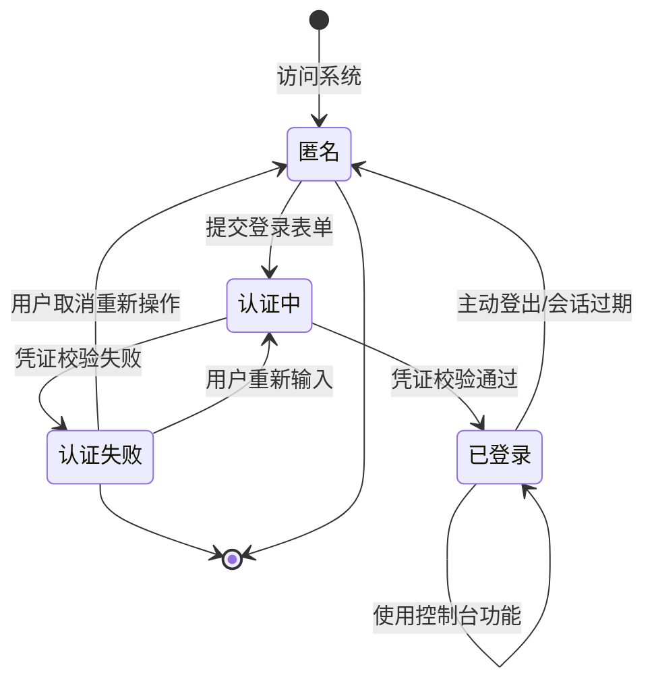

# 测试规格: 控制台页面创建与品牌替换

> **版本**: v1.0.0  
> **创建日期**: 2026-05-08  
> **状态**: Draft 
> **输入**: 用户描述：1、创建控制台页，按照@screanshots/华为云控制台.png 的内容和样式来创建 2、设置管理员初始账号密码：admin/admin@123 3、当登录页登录成功时，跳转到控制台页 4、所有"华为云"相关字眼全改为"Lee云"

---

## 第一章｜模板前置说明

### 【标准模板原文】

本模板是面向"功能测试"的标准规格说明文件（Function Test Specification），用于在需求/设计阶段对功能行为进行结构化定义与验收约束。其定位与约束如下：

1. **模板定位**：属于项目 `constitution.md` 定义体系下的二级测试文档，与性能、安全、可靠性等专项测试 Spec 并列，仅聚焦"功能行为与交互"测试。
2. **使用范围**：适用于新增功能、功能重构、跨模块交互调整等涉及**业务逻辑变更**的测试场景。不适用于纯 UI 美化、文案优化、基础设施升级等非功能变更。
3. **填写规则**：
   - 所有章节均不得留空；不适用的章节应显式填写"无"。
   - 所有表格必须逐行填写完整，不得合并单元格或遗漏必填列。
   - 使用统一的术语与对象命名，确保与需求文档、设计文档、代码命名一致。
   - 图表统一使用 Mermaid 语法绘制，避免引入外部图片或不可编辑图形。
   - 若某章节在编写过程中发现缺失或不适用，必须在本章"填写规则补充"中记录原因并经负责人确认。

### 【填写规则补充】

- 本项目测试类型为**功能测试**，聚焦控制台页面创建、登录跳转逻辑、品牌文案替换的功能行为验证。

---

## 第二章｜顶层宪章合规申明

### 【标准模板原文】

本 Spec 严格遵循项目 `constitution.md` 顶层宪章约束，所有测试相关动作必须满足以下法定要求：

1. **需求对齐原则**：本 Spec 所有内容 100% 对齐系统需求 Spec、系统架构 Spec 的功能逻辑、数据模型、交互规则；无本 Spec 依据的测试动作一律禁止，任何超出系统需求 Spec 与系统架构 Spec 范围的"额外测试"不得作为合入或放行依据。
2. **合规刚性原则**：所有测试验收标准完全符合绑定的 RFC 协议规范、行业标准，无合规缺口；验收判定不得以"项目自定义"为由降低或偏离已发布的 RFC/行业强制标准要求。
3. **全量追溯原则**：本 Spec 全生命周期操作可追溯、测试执行全流程数据可追溯、日志可追溯；从 Spec 编制、评审修改、测试执行、验收判定到最终合入，每一环节的操作人、操作时间、操作依据及输出产物均须留痕并可正向/反向查询。

---

## 第三章｜核心测试目标

1. **对齐系统定义**：验证控制台页面的内容布局、组件结构符合设计稿（`screanshots/华为云控制台.png`）的定义，管理员账号认证逻辑、登录跳转行为符合功能需求描述。
2. **全量场景覆盖**：全量覆盖本次需求的 4 个核心功能场景：控制台页面创建、管理员初始凭证配置、登录成功跳转、品牌文案替换，无测试盲区。
3. **继承性回归验证**：验证登录页原有功能在新增的跳转逻辑下无劣化，管理员初始账号创建不影响已有认证流程。
4. **合规与准入**：确保品牌替换（"华为云"→"Lee云"）在系统中 100% 覆盖，无遗漏遗漏。

---

## 第四章｜法定测试范围

### 【标准模板原文】

法定测试范围是本 Spec 的核心内容，包含以下四个子部分：

#### 4.1 功能应用场景定义

| 场景 ID | 场景名称 (正常/异常/边缘) | 前置条件 | 触发条件 | 优先级 |
|---------|---------------------------|----------|----------|--------|
| SC-01 | 控制台页面渲染展示（正常） | 访问登录页并成功认证 | 登录成功后跳转至控制台页，页面完整渲染 | P0 |
| SC-02 | 管理员初始凭证登录（正常） | 系统已完成初始化，管理员账号密码已设置 | 使用 admin/admin@123 登录，认证成功 | P0 |
| SC-03 | 登录成功后页面跳转（正常） | 用户在登录页输入有效凭证并提交 | 认证成功后跳转至控制台页面 | P0 |
| SC-04 | 无效凭证登录拒绝（异常） | 用户在登录页输入错误凭证 | 认证失败，停留在登录页并提示错误信息 | P1 |
| SC-05 | 空凭证提交拦截（异常） | 用户在登录页未输入用户名或密码 | 提交按钮不可用或提示必填项缺失 | P1 |
| SC-06 | 品牌文案全量替换验证（正常） | 全系统任意页面加载完成 | 页面所有文案中不存在"华为云"字样 | P0 |
| SC-07 | 默认密码首次强制修改（边缘） | 管理员首次以 admin/admin@123 登录 | 跳转至密码修改提示页面 | P2 |
| SC-08 | 控制台页未登录直接访问拦截（异常） | 未认证用户直接输入控制台页 URL | 强制重定向至登录页 | P1 |
| SC-09 | 控制台页顶部搜索功能（正常） | 用户已登录并处于控制台页 | 输入服务关键词搜索 | P1 |
| SC-10 | 控制台页导航栏交互（正常） | 用户已登录并处于控制台页 | 点击导航栏"备案""资源""费用"等菜单项 | P2 |

> 填写要求：场景名称需显式注明类型（正常/异常/边缘）；触发条件需可操作、可复现；优先级 P0 > P1 > P2 > P3。

#### 4.2 被测对象、属性与属性取值定义

| 编号 | 对象类型 | 对象名称 | 属性名称 | 数据类型 | 合法取值范围/枚举值 | 非法取值范围 | 优先级 |
|------|----------|----------|----------|----------|----------------------|----------------|--------|
| OP-01 | 用户账号 | Credential.username | 用户名 | String | `admin`（初始管理员）| 空字符串、超长字符(>64) | P0 |
| OP-02 | 用户账号 | Credential.password | 密码 | String | `admin@123`（初始管理员）| 空字符串 | P0 |
| OP-03 | 页面路由 | Route.destination | 目标页面 | String | `/console`（控制台）| 未定义的路径 | P0 |
| OP-04 | 认证状态 | Auth.status | 认证状态 | Enum | `authenticated` / `unauthenticated` | 非以上枚举值 | P0 |
| OP-05 | 品牌文案 | Brand.name | 品牌名称 | String | `Lee云` | `华为云`、空字符串 | P0 |
| OP-06 | 用户角色 | User.role | 用户角色 | Enum | `admin` / `viewer` / `editor`（预留）| 非以上枚举值 | P1 |
| OP-07 | 登录页面 | LoginPage | 可见性 | Boolean | `true`（未登录时）/ `false`（已登录后）| N/A | P0 |
| OP-08 | 控制台页面 | ConsolePage | 可见性 | Boolean | `true`（已登录后）/ `false`（未登录时）| N/A | P0 |

> 填写要求：对象名称须与数据模型或领域命名一致；数据类型需精确；合法/非法取值必须互斥且覆盖全空间。

#### 4.3 测试操作定义

| 编号 | 操作类型 | 操作对象 | 操作动作 | 操作描述 |
|------|----------|----------|----------|----------|
| ACT-01 | 查询 | ConsolePage | 验证页面渲染 | 打开控制台页，验证所有 UI 组件（顶部栏、导航栏、面板卡片）均正确显示 |
| ACT-02 | 操作 | LoginPage | 管理员登录 | 在登录页输入用户名 `admin`、密码 `admin@123`，点击登录按钮 |
| ACT-03 | 查询 | Route | 验证跳转结果 | 确认浏览器 URL 地址变为控制台路径，页面内容切换为控制台页 |
| ACT-04 | 操作 | LoginPage | 错误凭证输入 | 输入错误的用户名或密码，点击登录按钮 |
| ACT-05 | 查询 | AuthStatus | 验证错误提示 | 确认页面停留在登录页，并显示认证失败提示信息 |
| ACT-06 | 查询 | GlobalText | 全量文案检索 | 遍历系统所有可见页面，搜索是否存在"华为云"字样 |
| ACT-07 | 查询 | BrandText | 品牌替换验证 | 在原设计稿中"华为云"出现的位置（Logo、标题、描述等），验证替换为"Lee云" |
| ACT-08 | 操作 | LoginPage | 空输入测试 | 不输入任何内容，直接操作登录按钮或 Tab 键测试 |
| ACT-09 | 操作 | ConsolePage | 未授权访问 | 在浏览器地址栏直接输入控制台页 URL 并回车 |
| ACT-10 | 查询 | LoginPage | 重定向验证 | 确认强制跳转至登录页 |
| ACT-11 | 操作 | ConsolePage | 首改提示 | 使用 admin/admin@123 首次登录 |
| ACT-12 | 查询 | PasswordPrompt | 密码修改提示 | 确认是否弹出密码修改提示页/弹窗 |
| ACT-13 | 操作 | ConsoleSearch | 搜索操作 | 在控制台页搜索栏输入关键词并执行搜索 |
| ACT-14 | 查询 | SearchResult | 搜索结果验证 | 验证搜索结果页面跳转和内容匹配度 |
| ACT-15 | 操作 | ConsoleNav | 导航操作 | 点击导航栏菜单项 |
| ACT-16 | 查询 | SubPage | 子页面跳转 | 验证对应子页面正确加载 |

> 填写要求：操作类型包括但不限于 `创建/查询/更新/删除/调用`；操作描述须包含输入参数、执行步骤及预期中间状态。

#### 4.4 功能处理流程定义

1. **业务主流程图**（正常流程），使用 Mermaid 流程图描述。
2. **异常分支流程列表**，包含：分支 ID、触发节点、触发条件、处理流程、优先级。
3. **核心状态机定义**，使用 Mermaid 状态图描述关键对象的状态迁移路径。

### 【具体填写内容】

#### 4.1 功能应用场景定义

| 场景 ID | 场景名称 (类型) | 前置条件 | 触发条件 | 优先级 |
|---------|-----------------|----------|----------|--------|
| SC-01 | 控制台页面渲染展示（正常） | 系统初始化完成，管理员账号已创建 | 用户成功登录后访问控制台页，页面完整渲染 | P0 |
| SC-02 | 管理员初始凭证登录（正常） | 系统首次启动，初始账号密码已配置 | 使用 admin/admin@123 在登录页提交 | P0 |
| SC-03 | 登录成功后页面跳转（正常） | 用户输入有效凭证并提交 | 认证成功后路由跳转至 `/console` | P0 |
| SC-04 | 无效凭证登录拒绝（异常） | 用户在登录页输入错误用户名或密码 | 系统返回"凭证无效"或"用户名或密码错误"提示 | P1 |
| SC-05 | 空凭证提交拦截（异常） | 用户未输入用户名或密码直接提交 | 系统拦截并提示"请输入用户名/密码" | P1 |
| SC-06 | 品牌文案全量替换验证（正常） | 系统任意页面完成加载 | 在页面源代码中搜索"华为云"结果为零条 | P0 |
| SC-07 | 默认密码首次强制修改（边缘） | 管理员使用 admin/admin@123 首次登录 | 系统弹出"首次强制修改密码"页面 | P2 |
| SC-08 | 控制台页未登录直接访问拦截（异常） | 用户处于未登录状态 | 强制跳转回登录页面 | P1 |
| SC-09 | 控制台页顶部搜索功能（正常） | 用户已登录并处于控制台页 | 输入服务关键词搜索并展示结果 | P1 |
| SC-10 | 控制台页导航栏交互（正常） | 用户已登录并处于控制台页 | 验证对应子页面正确加载 | P2 |

#### 4.2 被测对象、属性与属性取值定义

| 编号 | 对象类型 | 对象名称 | 属性名称 | 数据类型 | 合法取值范围/枚举值 | 非法取值范围 | 优先级 |
|------|----------|----------|----------|----------|----------------------|----------------|--------|
| OP-01 | 用户账号 | Credential.username | 用户名 | String | `admin`（初始管理员），长度 1~64 字母数字下划线 | 空字符串、含特殊字符(除下划线)、超长(>64) | P0 |
| OP-02 | 用户账号 | Credential.password | 密码 | String | 符合密码策略（含大小写字母、数字、特殊字符，≥8 位） | 空字符串、不满足密码策略 | P0 |
| OP-03 | 页面路由 | Route.path | 控制台路径 | String | `/console` | 未定义的路径、含非法 URL 字符 | P0 |
| OP-04 | 认证状态 | Auth.loggedIn | 认证状态 | Boolean | `true`（已登录）/ `false`（未登录）| N/A | P0 |
| OP-05 | 品牌文案 | Brand.displayName | 品牌名称 | String | `Lee云` | `华为云`、空字符串、含 HTML 标签 | P0 |
| OP-06 | 用户角色 | User.roleType | 用户角色 | Enum | `admin` / `viewer` / `editor` | 非以上枚举值、空值 | P1 |
| OP-07 | 控制台组件 | ConsolePage.logoUrl | Logo 地址 | String | 指向 Lee云 品牌 Logo 图片 URL | 404 链接、非图片资源 | P0 |
| OP-08 | 控制台组件 | ConsolePage.region | 区域选择器 | String | `华北-北京四` / `华南-广州` 等 | 未定义的区域名称 | P1 |

#### 4.3 测试操作定义

| 编号 | 操作类型 | 操作对象 | 操作动作 | 操作描述 |
|------|----------|----------|----------|----------|
| ACT-01 | 查询 | ConsolePage | 验证页面渲染 | 打开控制台页，验证顶部导航栏、搜索栏、概览面板、服务视图等所有组件均正确显示 |
| ACT-02 | 操作 | LoginPage | 管理员登录 | 在登录页输入用户名 `admin`、密码 `admin@123`，点击登录按钮 |
| ACT-03 | 查询 | Route | 验证跳转结果 | 确认浏览器 URL 变为 `/console`，页面内容切换为控制台页 |
| ACT-04 | 操作 | LoginPage | 错误凭证输入 | 输入用户名 `wrong` 或密码 `wrongpass`，点击提交 |
| ACT-05 | 查询 | AuthStatus | 验证错误提示 | 确认页面停留在登录页，并显示错误提示信息 |
| ACT-06 | 查询 | GlobalText | 全量文案检索 | 遍历系统所有可见页面，检索是否存在"华为云"残存文案 |
| ACT-07 | 查询 | BrandText | 品牌替换验证 | 在原"华为云"Logo 位置、页面标题等区域，验证已替换为"Lee云" |
| ACT-08 | 操作 | LoginPage | 空输入测试 | 不输入任何内容直接点击登录按钮 |
| ACT-09 | 操作 | Browser | 未授权直接访问 | 在浏览器地址栏直接输入控制台页 URL（如 `http://localhost/console`） |
| ACT-10 | 查询 | LoginPage | 重定向验证 | 确认页面被强制重定向至登录页而非控制台页 |
| ACT-11 | 操作 | LoginPage | 首次登录 | 系统启动后首次使用 admin/admin@123 登录 |
| ACT-12 | 查询 | PasswordPrompt | 验证密码修改提示 | 确认是否弹出"首次登录需强制修改密码"的弹窗或跳转 |
| ACT-13 | 操作 | ConsoleSearch | 执行搜索 | 在控制台页搜索栏输入关键词并按回车 |
| ACT-14 | 查询 | SearchResult | 验证搜索结果 | 验证搜索结果页面正确加载，内容匹配搜索关键词 |
| ACT-15 | 操作 | ConsoleNav | 点击导航菜单 | 点击导航栏"备案"、"资源"、"费用"等菜单项 |
| ACT-16 | 查询 | SubPage | 验证子页跳转 | 验证对应子页面正确加载 |

#### 4.4 功能处理流程定义

**业务主流程图:**

```mermaid
graph TD
    Start[用户访问系统] --> LoginCheck{已登录?}
    LoginCheck -->|否| Login[显示登录页面]
    Login --> Input{输入凭证?}
    Input -->|用户名=admin, 密码=admin@123| Auth{认证通过?}
    Input -->|空输入/错误| ShowError[显示错误提示]
    ShowError --> Login
    Auth -->|是| Redirect[跳转至 /console]
    Auth -->|否| ShowError
    Redirect --> LoadConsole[加载控制台页面]
    LoadConsole --> FirstLogin{是否首次登录?}
    FirstLogin -->|是| PwdChange[提示修改密码]
    PwdChange --> BrandCheck
    FirstLogin -->|否| BrandCheck
    BrandCheck[验证品牌文案] --> CheckBrand{是否存在"华为云"?}
    CheckBrand -->|是| Fail[测试不通过]
    CheckBrand -->|否| Verify[验证页面组件完整性]
    Verify --> CheckComponents{所有组件均渲染?}
    CheckComponents -->|否| Fail
    CheckComponents -->|是| Success[测试通过]
    Fail --> End[流程结束]
    Success --> End
```

**异常分支流程：**

| 分支 ID | 触发节点 | 触发条件 | 处理流程 | 优先级 |
|---------|----------|----------|----------|--------|
| EX-01 | Auth | 凭证不匹配 | 返回"用户名或密码错误"提示，不跳转 | P0 |
| EX-02 | Input | 用户名或密码为空 | 按钮禁用或提示必填项缺失 | P1 |
| EX-03 | FirstLogin | 管理员首次登录 | 弹出"首次登录请修改默认密码"提示 | P2 |
| EX-04 | LoginCheck | 未登录状态直接请求 /console | 强制重定向至登录页 | P1 |
| EX-05 | BrandCheck | 页面中存在残存"华为云"字样 | 测试标记为不通过，记录残存位置 | P0 |
| EX-06 | LoadConsole | 页面组件渲染失败 | 显示错误页面或加载失败提示 | P1 |

**核心状态机（Auth 认证状态）:**



---

## 第五章｜功能交互与耦合关系定义

### 【标准模板原文】

本章节从外部交互与内部耦合两个维度，定义被测功能与其他模块/系统之间的协作关系，确保测试覆盖交互边界与耦合影响面。

#### 5.1 功能交互定义

从**外部视角**分析应用组合关系，明确功能之间的接口级交互行为：

| 交互ID | 交互类型 | 关系类型 | 交互双方 | 交互接口/协议 | 交互核心内容 | 优先级 |
|--------|----------|----------|----------|---------------|--------------|--------|
| IT-01 | 同步调用 | 依赖 | 登录页 → 认证服务 | HTTP POST /api/auth/login | 用户名密码校验 | P0 |
| IT-02 | 路由跳转 | 依赖 | 认证服务 → 控制台页 | 应用内路由导航 | 认证成功后跳转至 /console | P0 |
| IT-03 | 数据读取 | 依赖 | 控制台页 → 品牌配置 | 配置读取 / 常量引入 | 品牌名称 Lee云 | P0 |
| IT-04 | 会话管理 | 被依赖 | 认证服务 → 浏览器 | Cookie / Session Storage | 存储用户登录态 | P0 |
| IT-05 | 路由守卫 | 保护 | 路由守卫 → 控制台页 | 路由拦截 | 未登录用户拦截重定向 | P0 |
| IT-06 | 密码策略 | 依赖 | 登录页 → 密码策略服务 | 表单校验 | 密码复杂度校验（预留） | P2 |

> 填写要求：
> - **交互类型**：`同步调用 / 异步消息 / 事件广播 / 轮询 / 回调` 等
> - **关系类型**：`依赖 / 被依赖 / 对等 / 聚合` 等
> - **交互双方**：明确主调方与被调方（如"ECS 控制台服务 → Nova 计算服务"）
> - **交互接口/协议**：具体接口名称或协议（如 `HTTP REST / gRPC / DMS Kafka / MySQL Binlog`）
> - **交互核心内容**：本次交互传递的核心数据或业务语义（如"规格变更请求/任务状态响应"）
> - **优先级**：P0 > P1 > P2 > P3

#### 5.2 功能耦合关系定义

从**内部视角**分析实现依赖关系，明确功能模块之间的代码级耦合约束：

| 耦合ID | 耦合对象名称 | 耦合类型 | 耦合强度 | 耦合影响范围 | 关系类型 | 测试要求 | 优先级 |
|--------|--------------|----------|----------|--------------|----------|----------|--------|
| CP-01 | LoginForm | 代码引用 | 中耦合 | 修改登录表单影响认证流程与登录体验 | 调用 | 联合集成测试 | P0 |
| CP-02 | RouteGuard | 代码引用 | 中耦合 | 路由守卫影响所有受保护页面的访问控制 | 调用 | 独立模块测试 + 集成测试 | P0 |
| CP-03 | BrandConfig | 数据共享 | 弱耦合 | 品牌配置为全局常量，修改后影响全系统品牌展示 | 共享 | 配置变更验证 | P0 |
| CP-04 | DashboardComponents | 数据共享 | 弱耦合 | 控制台页组件间共享用户状态和区域选择 | 共享 | 组件独立测试 | P1 |
| CP-05 | AuthStore | 状态共享 | 中耦合 | 认证状态存储影响登录态与未登录态页面的可见性 | 共享 | 状态流测试 | P0 |

> 填写要求：
> - **耦合对象名称**：类名/模块名/服务名/组件名
> - **耦合类型**：`代码引用 / 数据共享 / 状态共享 / 配置依赖 / 时序依赖` 等
> - **耦合强度**：`强耦合（不可独立部署/测试）/ 中耦合（可独立部署但需联合测试）/ 弱耦合（可独立部署/测试）`
> - **耦合影响范围**：耦合变更影响的范围描述
> - **关系类型**：`调用 / 被调用 / 共享 / 监听` 等
> - **测试要求**：针对该耦合关系需要执行的测试动作
> - **优先级**：P0 > P1 > P2 > P3

---

## 第六章｜法定不测试范围

### 【标准模板原文】

本 Spec 仅覆盖"功能行为"测试范畴。以下范围明确排除在本次测试之外，对应的测试职责由专项测试 Spec 覆盖：

1. **性能维度**：包括但不限于接口响应时间、吞吐量、并发能力、压力极限测试。由《性能测试 Spec》覆盖。
2. **可靠性维度**：包括但不限于系统容灾、网络故障恢复、数据备份与恢复、长时间运行稳定性。由《可靠性测试 Spec》覆盖。
3. **安全维度**：包括但不限于越权访问、SQL 注入、XSS、CSRF、敏感数据泄露、权限绕过。由《安全测试 Spec》覆盖。
4. **兼容性维度**：包括但不限于跨浏览器、跨操作系统、跨设备分辨率、移动端 OS 版本。由《兼容性测试 Spec》覆盖。
5. **UI 与视觉维度**：颜色、字体、布局、动效、图标等前端视觉表现。本 Spec 仅验证 UI 组件的存在性和基本可操作性，不验证视觉精度和美观度。由 UI/UX 验收规范覆盖。
6. **其他**：任何未在本 Spec"法定测试范围"中明确列出的场景、对象、操作或流程。

### 【具体排除说明】

- **视觉精度排除**：控制台页各面板的 CSS 样式、像素级对齐、颜色值、动效等不纳入本 Spec 测试范围，仅验证关键 UI 元素（导航栏、搜索栏、面板、卡片）是否存在。
- **安全排除**：密码加密传输策略、会话令牌安全性、暴力破解防护等由安全测试 Spec 覆盖。
- **兼容性排除**：控制台页在不同分辨率下的响应式表现由兼容性测试 Spec 覆盖。

---

## 第七章｜刚性验收标准

### 【标准模板原文】

本 Spec 的验收标准为"必须通过"的刚性条款，任一未通过项均视为验收失败。验收标准包括但不限于以下五类：

#### 7.1 被测对象与属性验收标准

- 管理员初始用户名必须为 `admin`、密码必须为 `admin@123`，认证服务须接受该凭证组合并返回成功状态
- 认证失败时，系统不得跳转至控制台页。
- 控制台页必须存在 Logo、导航菜单、搜索栏、概览面板、安全监控面板、费用面板等关键组件（依据设计稿 `screanshots/华为云控制台.png`）
- 全系统页面源代码中（包含 HTML 源码中"华为云"（含全角/半角）出现次数必须为 0。
- "Lee云"必须出现在原"华为云"出现的所有位置（Logo 区域、页面标题、帮助文案等）

#### 7.2 功能场景与处理流程覆盖验收标准

- 所有 10 个测试场景（SC-01~SC-10）必须 100% 执行并记录结果。少于任一场景视为验收不通过。
- 主流程中的"登录→跳转→渲染→品牌验证"必须按顺序执行。
- 异常分支中的凭证拦截逻辑、未登录拦截逻辑必须生效。

#### 7.3 功能交互与耦合验收标准

- 登录页与认证服务之间必须正确完成凭证提交与响应接收；若认证服务返回失败，登录页不得跳转。
- 路由守卫必须在每次导航请求时检查认证状态；未登录状态下请求 /console 必须被拦截并重定向至登录页。
- 品牌配置变更必须全局生效，无需重启服务或手动刷新。

#### 7.4 继承性回归验收标准

- 因本次新增"登录成功跳转控制台页"逻辑，需回归验证"登录页原有认证功能"、"登录失败错误提示"、"登出回登录页"等存量场景，确认无劣化。
- 回归场景列表：登录页空输入拦截、登出功能、密码修改功能（若存在）。

#### 7.5 合规验收标准

- 管理员初始密码 `admin@123` 必须在首次登录后强制要求修改（若业务规则要求）；或至少在测试报告中记录该风险。
- 品牌替换不得遗留任何"华为云"字样，包括隐藏元数据、SEO 描述、favicon 文本等。
- 控制台页的所有功能模块名称、导航文案均符合业务定义。

---

## 附录｜设计稿对照清单

| UI 区域 | 设计稿描述 | 替换后预期 | 验证方法 |
|---------|------------|------------|----------|
| Logo 区域 | 左上角"华为云" Logo + 文字 | "Lee云" Logo + 文字 | 视觉检查 + 源码检查 |
| 页面标题 | "控制台 \| 华北-北京四" | "控制台 \| Lee云 \| 华北-北京四" | 源码 title 标签检查 |
| 顶部导航栏 | "华为云"相关链接、菜单项 | "Lee云" | 源码检查 |
| 搜索栏提示文案 | "搜索华为云服务..." | "搜索Lee云服务..." | 源码检查 |
| 页脚版权信息 | "© 华为云" | "© Lee云" | 源码检查 |
| 帮助/文档入口 | "华为云文档"、"华为云社区" | "Lee云文档"、"lee云社区" | 源码检查 |
| 欢迎文案 | "欢迎来到华为云" | "欢迎来到Lee云" | 源码检查 |
