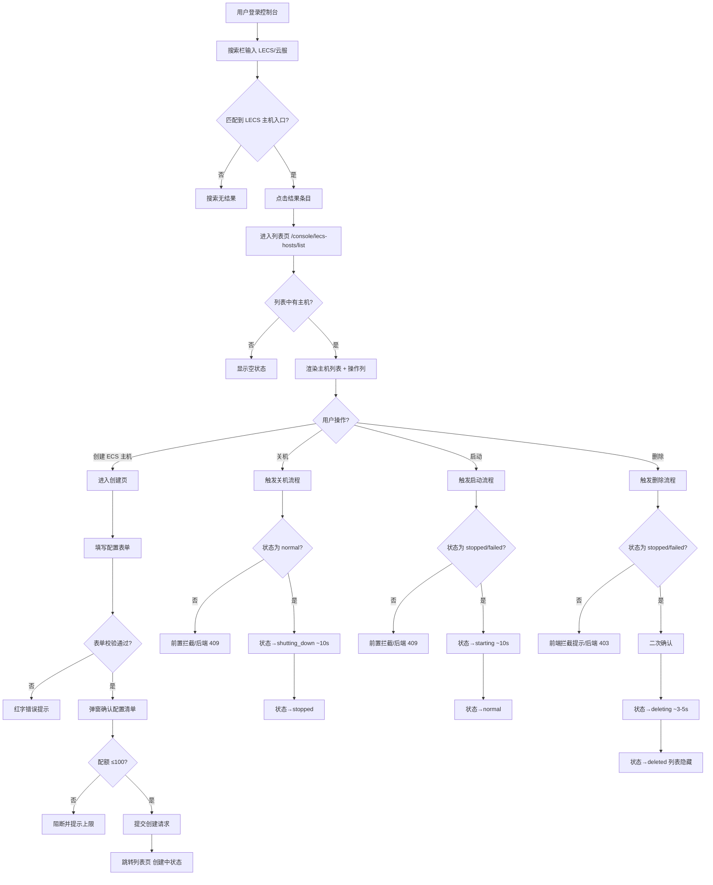
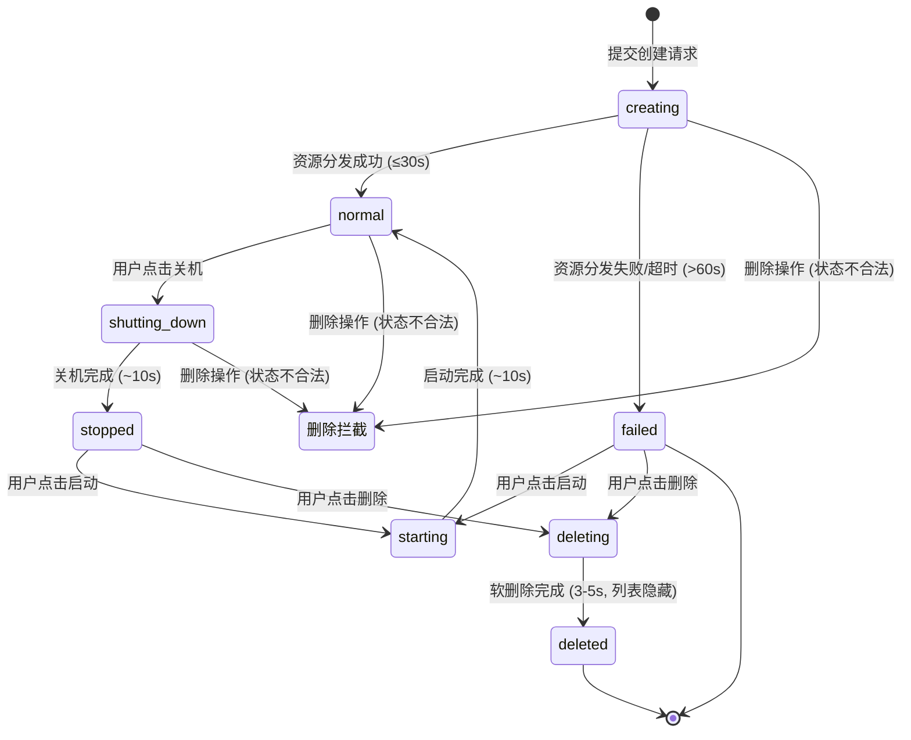

# 测试规格: LECS主机生命周期管理

> **版本**: v1.0.0  
> **创建日期**: 2026-05-09  
> **状态**: 草稿  
> **输入**: 用户描述：LECS主机（云服务器）功能开发：支持在控制台搜索、列表查看、创建、开关机控制及删除操作，前端页面风格与控制台保持一致  
> **测试类型**: 功能测试

---

## 第一章｜模板前置说明

### 【标准模板原文】

本模板是面向"功能测试"的标准规格说明文件（Function Test Specification），用于在需求/设计阶段对功能行为进行结构化定义与验收约束。其定位与约束如下：

1. **模板定位**：属于项目 `constitution.md` 定义体系下的二级测试文档，与性能、安全、可靠性等专项测试 Spec 并列，仅聚焦"功能行为与交互"测试。
2. **使用范围**：适用于新增功能、功能重构、跨模块交互调整等涉及**业务逻辑变更**的测试场景。不适用于纯 UI 美化、文案优化、基础设施升级等非功能变更。
3. **填写规则**：
   - 所有章节均不得留空；不适用的章节应显式填写"无"。
   - 所有表格必须逐行填写完整，不得合并单元格或遗漏必填列。
   - 使用统一的术语与对象命名，确保与需求文档、设计文档、代码命名一致。
   - 图表统一使用 Mermaid 语法绘制，避免引入外部图片或不可编辑图形。
   - 若某章节在编写过程中发现缺失或不适用，必须在本章"填写规则补充"中记录原因并经负责人确认。

### 【举例】

- **示例项目**：Lee云平台 LECS 主机生命周期管理——允许用户在控制台完成 LECS 主机的搜索入口导航、列表查看、资源创建、开关机控制及安全删除的完整生命周期操作。
- **使用范围示例**：适用于"LECS主机创建逻辑"调整、状态机矩阵规则变更、配额校验策略变更、计费模式计算逻辑调整等涉及功能行为变化的场景。
- **不适用场景示例**：仅修改 LECS 控制台"创建ECS主机"按钮颜色、调整页面提示文案等纯前端 UI 改动不强制使用本模板。
- **填写规则示例**：状态值统一使用需求文档中定义的枚举，如 `creating`、`normal`、`stopped`、`failed`，而非前端展示的中文标签；优先级统一使用 P0～P3 四级。

---

## 第二章｜顶层宪章合规申明

### 【标准模板原文】

本 Spec 严格遵循项目 `constitution.md` 顶层宪章约束，所有测试相关动作必须满足以下法定要求：

1. **需求对齐原则**：本 Spec 所有内容 100% 对齐系统需求 Spec、系统架构 Spec 的功能逻辑、数据模型、交互规则；无本 Spec 依据的测试动作一律禁止，任何超出系统需求 Spec 与系统架构 Spec 范围的"额外测试"不得作为合入或放行依据。
2. **合规刚性原则**：所有测试验收标准完全符合绑定的 RFC 协议规范、行业标准，无合规缺口；验收判定不得以"项目习惯"为由降低或偏离已发布的 RFC/行业强制标准要求。
3. **全量追溯原则**：本 Spec 全生命周期操作可追溯、测试执行全流程数据可追溯、日志可追溯；从 Spec 编制、评审修改、测试执行、验收判定到最终合入，每一环节的操作人、操作时间、操作依据及输出产物均须留痕并可正向/反向查询。

### 【举例】

- **需求对齐示例**：LECS 主机的状态流转逻辑（`creating → normal → shutting_down → stopped → starting → normal`）必须与需求规格说明书中定义的状态机完全一致；测试人员不得自行添加需求中未定义的"重启"操作验证。
- **合规刚性示例**：DELETE 接口对运行态主机的状态拦截必须返回 403 状态码，响应体必须包含 `code: "NOT_STOPPED"` 字段；不得以"前端已拦截"为由跳过后端状态校验验证。
- **全量追溯示例**：测试人员执行 SC-15（配额上限创建拦截）时，必须在测试管理系统中记录：操作人、执行时间、依据版本（Spec v1.0）、测试结果、配额系统日志链接；后续审计可通过 SC-15 反向查找到全部执行日志与相关 Spec 版本变更历史。

---

## 第三章｜核心测试目标

### 【标准模板原文】

1. **对齐系统定义**：验证 LECS 主机生命周期管理的对象属性、状态取值、处理流程、交互逻辑 100% 符合需求规格说明书的定义，无逻辑偏差、无功能遗漏。
2. **全量场景覆盖**：全量覆盖本次需求的 5 个用户故事（控制台搜索跳转、列表查看与操作矩阵、主机创建、开关机控制、安全删除）及所有边界场景（配额限制、超时降级、并发锁、网络断连恢复），无测试盲区。
3. **继承性回归验证**：验证版本迭代的功能变更符合继承性要求，存量功能（控制台搜索、认证系统、配额系统）无劣化、新增功能无缺陷、历史问题无复现。
4. **合规与准入**：确保功能实现完全符合 JWT Cookie 认证、CSRF 保护、操作日志审计等安全合规要求，满足版本上线准入标准。

### 【举例】

- **对齐示例**：LECSHost 数据模型中的 `status` 枚举值（`creating`, `normal`, `failed`, `shutting_down`, `stopped`, `starting`, `deleting`, `deleted`）与操作列按钮置灰逻辑的映射矩阵 100% 一致。
- **覆盖示例**：正常创建、表单校验拦截、配额不足拦截、超时降级、并发操作冲突、网络断连恢复等全部场景和分支均已定义且 100% 执行。
- **回归示例**：本次 LECS 主机功能上线后，回归验证"控制台全局搜索"功能，确认 LECS 主机入口能正确匹配与跳转；确认现有认证系统 JWT Cookie 机制不受新增页面影响。
- **合规示例**：所有主机的创建、删除、开机、关机操作必须产生完整审计日志（操作人、操作时间、IP地址、操作详情），符合日志审计要求；API 响应码严格遵循 RESTful 规范（200/201/202/403/409）。

---

## 第四章｜法定测试范围

### 【标准模板原文】

法定测试范围是本 Spec 的核心内容，包含以下四个子部分：

#### 4.1 功能应用场景定义

| 场景 ID | 场景名称 (正常/异常/边缘) | 前置条件 | 触发条件 | 优先级 |
|---------|---------------------------|----------|----------|--------|
| SC-01   | 控制台搜索匹配 LECS 主机入口（正常）| 用户已登录控制台，搜索索引已更新 | 用户在搜索栏输入"LECS"或"云服" | P0 |
| SC-02   | 搜索结果点击跳转列表页（正常）| 搜索结果已展示 LECS 主机条目 | 用户点击搜索结果条目 | P0 |
| SC-03   | 列表页数据表格加载（正常）| 用户拥有至少一台 LECS 主机 | 用户进入列表页路由 `/console/lecs-hosts/list` | P0 |
| SC-04   | 列表页操作列按钮全显示（正常）| 列表中存在主机记录 | 用户查看列表任意行的操作列 | P0 |
| SC-05   | normal 态操作列置灰矩阵（正常）| 主机状态为 `normal` | 用户查看操作列 | P0 |
| SC-06   | stopped 态操作列置灰矩阵（正常）| 主机状态为 `stopped` | 用户查看操作列 | P0 |
| SC-07   | failed 态操作列置灰矩阵（正常）| 主机状态为 `failed` | 用户查看操作列 | P0 |
| SC-08   | deleting 态操作列全置灰（正常）| 主机状态为 `deleting` | 用户查看操作列 | P0 |
| SC-09   | 已删除主机列表隐藏（正常）| 主机数据库中 `deleted_at IS NOT NULL` | 用户刷新列表页 | P1 |
| SC-10   | 创建页六大板块完整展示（正常）| 用户在列表页点击"创建ECS主机" | 进入创建页 `/console/lecs-hosts/create` | P0 |
| SC-11   | 主机名校验-下划线开头（异常）| 用户在主机名输入框输入 `_abc123` | 输入完成失去焦点 | P1 |
| SC-12   | 主机名校验-长度越界（异常）| 用户输入 3 字符或 11 字符的主机名 | 输入完成失去焦点 | P1 |
| SC-13   | 凭据用户名校验-长度（异常）| 用户输入 3 字符或 17 字符的用户名 | 输入完成失去焦点 | P1 |
| SC-14   | 凭据密码校验-长度（异常）| 用户输入 7 字符或 33 字符的密码 | 输入完成失去焦点 | P1 |
| SC-15   | 配额上限创建拦截（异常）| 用户已有 100 台主机（`deleted_at IS NULL`） | 点击确认弹窗"确定"提交创建 | P0 |
| SC-16   | 计费模式-包年包月费用计算（正常）| 选择包年包月，实例规格 100 元/月，购买 3 个月 | 费用自动计算为 300 元 | P0 |
| SC-17   | 计费模式-按时计费费用计算（正常）| 选按时计费，实例规格 100 元/月 | 费用自动计算为 3.33 元/天（100/30） | P0 |
| SC-18   | IP 手工配置-格式错误（异常）| 选择手工配置，输入非法 IP 格式 | 输入完成失去焦点 | P1 |
| SC-19   | IP 掩码选择范围边界（边缘）| 选择手工配置，掩码下拉框 | 选择 8 或 24 | P2 |
| SC-20   | 确认弹窗配置清单完整性（正常）| 表单校验全部通过，点击立即购买 | 弹窗展示全部用户选择项与费用明细 | P0 |
| SC-21   | 创建提交后跳转列表页（正常）| 确认弹窗点击"确定" | 跳转列表页，新主机显示"创建中" | P0 |
| SC-22   | normal 态关机关机中异步流转（正常）| 主机状态为 `normal` | 操作列点击"关机" | P0 |
| SC-23   | 关机完成停终态 stopped（正常）| 主机状态为 `shutting_down`，等待 ~10 秒 | 后台任务完成 | P0 |
| SC-24   | stopped 态启动异步流转（正常）| 主机状态为 `stopped` | 操作列点击"启动" | P0 |
| SC-25   | 启动完成终态 normal（正常）| 主机状态为 `starting`，等待 ~10 秒 | 后台任务完成 | P0 |
| SC-26   | failed 态启动异步流转（正常）| 主机状态为 `failed` | 操作列点击"启动" | P1 |
| SC-27   | 过渡态并发操作拦截（异常）| 主机状态为 `shutting_down` / `starting` / `creating` / `deleting` | 操作列点击"关机"、"启动"或"删除" | P0 |
| SC-28   | 创建异步任务超时降级为 failed（异常）| 后台创建任务超过 60 秒未完成 | 等待超时 | P0 |
| SC-29   | normal 态删除拦截（异常）| 主机状态为 `normal` | 操作列点击"删除" | P0 |
| SC-30   | creating 态删除拦截（异常）| 主机状态为 `creating` | 操作列点击"删除" | P0 |
| SC-31   | shutting_down 态删除拦截（异常）| 主机状态为 `shutting_down` | 操作列点击"删除" | P0 |
| SC-32   | stopped 态删除成功（正常）| 主机状态为 `stopped` | 操作列点击"删除"，二次确认 | P0 |
| SC-33   | failed 态删除成功（正常）| 主机状态为 `failed` | 操作列点击"删除"，二次确认 | P1 |
| SC-34   | 删除完成列表消失配额释放（正常）| 主机状态为 `deleting`，等待 3~5 秒 | 主机行从列表消失，配额计数 -1 | P0 |
| SC-35   | 网络断连恢复后列表全量刷新（异常）| 断网期间有异步操作在进行 | 网络恢复 | P1 |
| SC-36   | 轮询启动与停止机制（正常）| 列表中存在过渡态主机 | 页面检测到 `creating`/`shutting_down`/`starting`/`deleting` 状态 | P1 |
| SC-37   | 管理员与普通用户权限隔离（异常）| 普通用户 A 与普通用户 B 各有主机 | 用户 A 尝试操作用户 B 的主机 | P0 |
| SC-38   | 未认证用户访问拦截（异常）| 用户未登录或 Token 失效 | 访问 `/console/lecs-hosts/list` | P0 |
| SC-39   | 操作系统默认镜像（正常）| 进入创建页 | 操作系统镜像下拉框默认展示 "Huawei Euler OS" | P2 |
| SC-40   | IP 分配方式 DHCP 模式（正常）| 创建页选择 DHCP 分配 | 无需额外配置，表单可正常提交 | P2 |

#### 4.2 被测对象、属性与属性取值定义

| 编号 | 对象类型 | 对象名称 | 属性名称 | 数据类型 | 合法取值范围/枚举值 | 非法取值范围 | 优先级 |
|------|----------|----------|----------|----------|----------------------|----------------|--------|
| OP-01 | LECS主机 | LECSHost | status | Enum(String) | `creating`, `normal`, `failed`, `shutting_down`, `stopped`, `starting`, `deleting`, `deleted` | 非以上枚举值 | P0 |
| OP-02 | LECS主机 | LECSHost | hostname | String(4-10) | `^[\w]{4,10}$` 且不可 `_` 开头 | 含特殊字符/含中文/长度越界/`_` 开头 | P0 |
| OP-03 | LECS主机 | LECSHost | billing_mode | Enum(String) | `包年/包月`, `按需计费` | 非以上枚举值 | P0 |
| OP-04 | LECS主机 | LECSHost | instance_type | Enum(String) | `经济型`, `高性能型` | 非以上枚举值 | P0 |
| OP-05 | LECS主机 | LECSHost | os_image | Enum(String) | `Huawei Euler OS`, `Ubuntu`, `Windows` | 非以上枚举值 | P1 |
| OP-06 | LECS主机 | LECSHost | ip_mode | Enum(String) | `DHCP 分配`, `手工配置` | 非以上枚举值 | P1 |
| OP-07 | LECS主机 | LECSHost | ip_address | String | 标准 IPv4 格式 (如 `192.168.1.100`) | 非正确 IP 格式的字符串 | P1 |
| OP-08 | LECS主机 | LECSHost | ip_mask | Integer | 8 ~ 24 正整数 | <8 或 >24 | P1 |
| OP-09 | LECS主机 | LECSHost | duration | Integer | 1~9, 12, 24 | 非以上值 | P0 |
| OP-10 | 访问凭证 | Credential | username | String(4-16) | 英文/数字/特殊字符，长度 4-16 | 含中文/长度越界 | P0 |
| OP-11 | 访问凭证 | Credential | password | String(8-32) | 英文/数字/特殊字符，长度 8-32 | 含中文/长度越界 | P0 |
| OP-12 | LECS主机 | LECSHost | deleted_at | DateTime | `NULL`（未删除）/ 有效时间戳（已删除） | 非时间格式的字符串 | P1 |
| OP-13 | LECS主机 | LECSHost | cost_info | JSON | `{"unit_price": Number, "billing_mode": String, "total": Number}` | 非合法 JSON/缺少必填字段 | P1 |
| OP-14 | 配额系统 | Quota | host_count | Integer | 0 ~ 100 | >100 | P0 |

#### 4.3 测试操作定义

| 编号 | 操作类型 | 操作对象 | 操作动作 | 操作描述 |
|------|----------|----------|----------|----------|
| ACT-01 | 查询 | 控制台搜索 | 输入关键词搜索 LECS 主机 | 在顶部搜索栏输入"LECS"或"云服"，验证下拉结果列表 |
| ACT-02 | 导航 | 搜索结果条目 | 点击跳转列表页 | 点击搜索结果中的"LECS 主机"条目，验证路由跳转与页面加载 |
| ACT-03 | 查询 | LECSHost | 查看列表页数据表格 | 进入列表页，验证主机名/ID、计费模式、状态标签、私有 IP、操作列完整渲染 |
| ACT-04 | 创建 | LECSHost | 填写创建表单并提交 | 依次配置基础配置/实例/操作系统/IP配置/购买时长，确认弹窗中点击"确定" |
| ACT-05 | 表单校验 | 创建表单 | 输入非法格式数据 | 在主机名、用户名、密码、IP 等输入框输入非法值，校验红字错误提示 |
| ACT-06 | 更新 | LECSHost | 执行关机操作 | 在列表操作列对 normal 态主机点击"关机"，验证状态流转 |
| ACT-07 | 更新 | LECSHost | 执行启动操作 | 在列表操作列对 stopped / failed 态主机点击"启动"，验证状态流转 |
| ACT-08 | 删除 | LECSHost | 执行安全删除 | 在列表操作列对 stopped 态主机点击"删除"，二次确认后验证异步删除与配额释放 |
| ACT-09 | 拦截 | LECSHost | 触发状态机拦截 | 在 normal / creating / shutting_down 态尝试删除，验证拦截 |
| ACT-10 | 轮询 | 前端列表 | 验证轮询启停机制 | 列表含过渡态时验证 3 秒/次轮询，终态后轮询停止 |
| ACT-11 | 查询 | LECSHost | 网络断连恢复后全量刷新 | 断网操作后恢复网络，验证列表重新 fetch 数据与数据库强一致 |

#### 4.4 功能处理流程定义

**业务主流程图：**

**异常分支流程：**

| 分支 ID | 触发节点 | 触发条件 | 处理流程 | 优先级 |
|---------|----------|----------|----------|--------|
| EX-01 | 表单校验 | 主机名/用户名/密码/IP 非法 | 实时红字提示，阻止提交 | P1 |
| EX-02 | 提交创建 | 配额已达 100 台上限 | 弹窗"主机数量达到上限"，阻断创建 | P0 |
| EX-03 | 创建任务 | 后端创建超时 >60s | 状态降级为 failed，前端停止轮询 | P0 |
| EX-04 | 关机操作 | 状态非 normal | 前端置灰不发起请求/后端 409 拒绝 | P0 |
| EX-05 | 启动操作 | 状态非 stopped/failed | 前端置灰不发起请求/后端 409 拒绝 | P0 |
| EX-06 | 删除操作 | 状态非 stopped/failed | 前端拦截提示"请先将主机关机"/后端 403 拒绝 | P0 |
| EX-07 | 并发操作 | 过渡态下重复点击 | 按钮 disabled，后端幂等处理 | P0 |
| EX-08 | 网络异常 | 操作进行中网络断连 | 网络恢复后全量 refetch 列表 | P1 |
| EX-09 | 权限异常 | 操作他人主机 | 后端拦截返回 403 Forbidden | P0 |
| EX-10 | 规格选择 | 未选择具体规格 | 实时红字提示阻止提交 | P1 |
| EX-11 | 认证失效 | Token 过期/无效 | 重定向至登录页 | P0 |

**核心状态机（以 LECSHost 为例）：**

---

## 第五章｜功能交互与耦合关系定义

### 【标准模板原文】

本章节从外部交互与内部耦合两个维度，定义被测功能与其他模块/系统之间的协作关系，确保测试覆盖交互边界与耦合影响面。

#### 5.1 功能交互定义

| 交互ID | 交互类型 | 关系类型 | 交互双方 | 交互接口/协议 | 交互核心内容 | 优先级 |
|--------|----------|----------|----------|---------------|--------------|--------|
| IT-01 | 同步调用 | 依赖 | LECS 前端 → 控制台搜索服务 | HTTP REST: 全局搜索接口 | 关键词匹配与结果返回 | P0 |
| IT-02 | 同步调用 | 依赖 | LECS 前端 → LECS 后端 API | HTTP REST: GET /api/v1/lecs-hosts | 分页查询主机列表 | P0 |
| IT-03 | 同步调用 | 依赖 | LECS 前端 → LECS 后端 API | HTTP REST: POST /api/v1/lecs-hosts | 异步创建主机请求 | P0 |
| IT-04 | 同步调用 | 依赖 | LECS 前端 → LECS 后端 API | HTTP REST: POST /api/v1/lecs-hosts/{id}/shutdown | 关机指令下发 | P0 |
| IT-05 | 同步调用 | 依赖 | LECS 前端 → LECS 后端 API | HTTP REST: POST /api/v1/lecs-hosts/{id}/start | 启动指令下发 | P0 |
| IT-06 | 同步调用 | 依赖 | LECS 前端 → LECS 后端 API | HTTP REST: DELETE /api/v1/lecs-hosts/{id} | 逻辑删除请求 | P0 |
| IT-07 | 轮询 | 依赖 | LECS 前端 → LECS 后端 API | HTTP REST: GET /api/v1/lecs-hosts (3s 间隔) | 状态轮询直到终态 | P0 |
| IT-08 | 同步调用 | 依赖 | LECS 后端 API → 配额系统 | HTTP REST / 内部 RPC | 配额校验 (≤100) 与扣减 | P0 |
| IT-09 | 异步消息 | 依赖 | LECS 后端 API → 异步任务队列 | Celery/RQ 消息队列 | 创建/关机/启动/删除异步任务分发 | P0 |
| IT-10 | 同步调用 | 依赖 | LECS 前端 → 认证系统 | JWT Cookie 认证 | Token 有效性校验 | P0 |
| IT-11 | 事件写入 | 被依赖 | LECS 后端 API → 审计日志系统 | 内部写入接口 | 操作日志记录（创建/删除/开关机） | P1 |
| IT-12 | 同步调用 | 依赖 | LECS 后端 API → 实例规格数据源 | 内部接口 | 获取实例规格配置与价格 | P1 |
| IT-13 | 同步调用 | 依赖 | LECS 后端 API → 操作系统镜像数据源 | 内部接口 | 获取可用操作系统镜像列表 | P1 |

#### 5.2 功能耦合关系定义

| 耦合ID | 耦合对象名称 | 耦合类型 | 耦合强度 | 耦合影响范围 | 关系类型 | 测试要求 | 优先级 |
|--------|--------------|----------|----------|--------------|----------|----------|--------|
| CP-01 | 状态矩阵校验器 | 代码引用 | 强耦合 | 修改状态矩阵影响关机/启动/删除全部操作列逻辑 | 调用 | 联合集成测试 | P0 |
| CP-02 | 配额计数器 | 数据共享 | 强耦合 | 配额统计范围修改影响创建拦截与删除释放逻辑 | 共享 | 数据一致性测试 | P0 |
| CP-03 | 异步任务 Worker | 时序依赖 | 强耦合 | Worker 执行耗时直接影响状态轮询与终态判定 | 被调用 | 超时与降级验证 | P0 |
| CP-04 | JWT 认证中间件 | 配置依赖 | 中耦合 | Token 策略变更影响 LECS 页面访问权限 | 被调用 | 权限拦截测试 | P0 |
| CP-05 | 前端轮询控制器 | 状态共享 | 中耦合 | 轮询间隔修改影响列表状态更新实时性与性能 | 调用 | 轮询启停机制验证 | P1 |
| CP-06 | 表单校验引擎 | 代码引用 | 弱耦合 | 校验规则变更影响创建页输入拦截 | 调用 | 边界值验证测试 | P1 |

---

## 第六章｜法定不测试范围

### 【标准模板原文】

本 Spec 仅覆盖"功能行为"测试范畴。以下范围明确排除在本次测试之外，对应的测试职责由专项测试 Spec 覆盖：

1. **性能维度**：不测试接口响应时间（如"API 响应 <200ms"）、列表并发查询性能、异步任务吞吐量等。由《性能测试 Spec》覆盖。
2. **可靠性维度**：不测试消息队列宕机后的自动恢复、数据库主从切换后的数据一致性、长时间运行稳定性。由《可靠性测试 Spec》覆盖。
3. **安全维度**：不测试越权访问绕过、SQL 注入、XSS/CSRF 漏洞利用、密码哈希破解、敏感数据内存泄露。由《安全测试 Spec》覆盖。但 JWT Cookie 认证拦截和 403 权限返回的功能行为验证属于本 Spec 范围。
4. **兼容性维度**：仅要求桌面端 1280px 及以上全功能展示，不验证平板/移动端适配、跨浏览器渲染差异。由《兼容性测试 Spec》覆盖。
5. **UI 与视觉维度**：不测试状态标签颜色（绿色/橙色/红色）、按钮置灰样式、页面布局对齐、动效流畅度。由 UI/UX 验收规范覆盖。
6. **不包含的功能**：不测试主机重启操作、VNC 控制台登录、安全组配置、弹性 IP 管理、数据盘挂载、快照备份、批量操作、主机标签管理、区域切换功能。
7. **其他**：任何未在本 Spec"法定测试范围"中明确列出的场景、对象、操作或流程。

---

## 第七章｜刚性验收标准

### 【标准模板原文】

本 Spec 的验收标准为"必须通过"的刚性条款，任一未通过项均视为验收失败。验收标准包括但不限于以下五类：

#### 7.1 被测对象与属性验收标准

- `LECSHost.hostname` 输入不满足 `^[\w]{4,10}$` 或以 `_` 开头时，必须拦截并提示错误信息。
- `LECSHost.hostname` 长度为 3 或 11 字符时，必须拦截且不允许提交。
- `Credential.username` 长度 <4 或 >16 时，必须拦截。
- `Credential.password` 长度 <8 或 >32 时，必须拦截。
- `ip_address` 非法格式时必须拦截并提示。
- `ip_mask` 不在 8~24 范围内时必须拦截。
- `duration` 不在 1~9、12、24 时必须拦截。
- `spec_id`（实例规格）未选择时必须拦截并提示。
- `LECSHost.status` 的值必须严格来自 8 个枚举值之一，不得产生未定义状态。
- 属性类型转换、精度舍入必须正确（如按需计费费用 = 单价 / 30，保留合理小数位）。

#### 7.2 功能场景与处理流程覆盖验收标准

- 全部 40 个测试场景（SC-01 ~ SC-40）必须 100% 执行并记录结果；缺少任一场景视为验收不通过。
- 状态机矩阵中 8 种状态 × 3 种操作（关机/启动/删除）的全部组合均已验证，按钮置灰/可用逻辑 100% 匹配需求定义。
- 主流程中的"创建→创建中→正常"、"正常→关机中→已关机→启动中→正常"、"正常/失败/已关机→删除中→已删除"必须严格按时序执行；若前端状态刷新与后端实际状态不同步，视为严重 Bug。
- 异步操作的轮询机制必须验证：过渡态时启动 3 秒轮询，终态时停止轮询，不得出现永驻轮询。

#### 7.3 功能交互与耦合验收标准

- LECS 前端向 LECS 后端提交关机请求后，后端返回 409 表示状态冲突；若返回 200 但状态未变更为 `shutting_down`，视为严重 Bug。
- DELETE 接口对 non-stopped/non-failed 状态必须返回 403，响应体必须包含 `code: "NOT_STOPPED"`；不得返回 200 或 500。
- 创建请求触发后，后端先返回 201（`status: creating`），异步 Worker 执行完成后回调更新终态。若 Worker 超时 >60s 未自动降级为 `failed`，视为严重 Bug。
- 配额校验在 `host_count = 100` 时必须阻断创建；`host_count = 99` 时必须允许创建（边界值验证）。
- 配额释放：删除完成后，`host_count` 必须严格 -1；并发删除场景下配额计数不得出现偏差。
- 权限隔离：普通用户 A 不得操作用户 B 的主机，后端必须以 403 返回。

#### 7.4 继承性回归验收标准

- 因本次 LECS 主机功能上线，需回归验证以下存量功能：
  - 控制台全局搜索：确保新增"LECS 主机"入口后，其他服务搜索不受影响
  - JWT Cookie 认证机制：确保新增页面不破坏现有认证流程
  - 配额系统：确保 LECS 主机配额计算不与其他资源配额冲突
- 回归场景 ID 列表：SC-01, SC-02, SC-37, SC-38

#### 7.5 合规验收标准

- 所有 LECS 主机的创建、删除、开机、关机操作必须写入审计日志，包含 `操作人`、`操作时间`、`IP地址`、`操作详情` 四个必含字段。
- `Credential.password` 必须加密存储（哈希），日志中必须脱敏。
- API 接口必须复用现有 CSRF 保护机制，创建/删除/开关机等非 GET 请求必须有 CSRF Token 校验。
- 软删除的主机在数据库中 `deleted_at IS NOT NULL`，但前端列表不得展示；数据库记录可审计，满足数据可追溯要求。

---

## 第八章｜成功标准

### 可衡量指标

| 编号 | 成功标准描述 | 视角 | 目标值 | 验证方式 |
|------|-------------|------|--------|----------|
| SC-1 | 用户在控制台搜索栏输入"LECS"后，可在 1 秒内看到匹配结果并点击跳转 | 用户行为 | 搜索匹配 + 跳转 ≤ 1 秒 | 操作计时 |
| SC-2 | LECS 主机列表页加载完成（含状态数据与操作列）时间不超过 2 秒 | 用户行为 | 列表加载 ≤ 2 秒 | 页面计时 |
| SC-3 | 列表页状态流转准确率 100%，无卡顿或状态不同步 | 系统行为 | 状态流转准确率 = 100% | 状态变更追踪 |
| SC-4 | 操作列按钮置灰逻辑与状态机矩阵匹配度 100%，无误触 | 系统行为 | 置灰匹配度 = 100% | 矩阵遍历验证 |
| SC-5 | 后端 DELETE 接口对运行态主机的拦截成功率 100%（返回 403） | 系统行为 | 拦截成功率 = 100% | API 自动化测试 |
| SC-6 | 所有可交互组件 100% 覆盖 `data-testid` 属性 | 系统行为 | `data-testid` 覆盖率 = 100% | 组件扫描验证 |
| SC-7 | 用户在 3 分钟内完成一台 LECS 主机的完整创建流程 | 用户行为 | 创建流程 ≤ 3 分钟 | 操作计时 |
| SC-8 | 关机操作触发后 10 秒内状态变更为"已关机" | 系统行为 | 关机流转 ≤ 10 秒 | 时间戳比对 |
| SC-9 | 启动操作触发后 10 秒内状态变更为"正常" | 系统行为 | 启动流转 ≤ 10 秒 | 时间戳比对 |
| SC-10 | 删除操作触发后 5 秒内主机从列表消失且配额计数减少 1 | 系统行为 | 删除流转 ≤ 5 秒 + 配额 -1 正确 | 列表检查 + 配额校验 |
| SC-11 | 表单校验拦截准确率 100%，所有非法输入均被拦截 | 系统行为 | 校验拦截率 = 100% | 边界值遍历测试 |
| SC-12 | 配额上限 100 台时创建拦截准确率 100% | 系统行为 | 拦截准确率 = 100% | 配额边界测试 |

### 假设

1. 实例规格数据（vCPU、内存、系统盘、价格）来自内部数据源，测试中使用需求文档中列出的 8 种规格配置作为验证基准。
2. 计费计算在前端按"实例单价 × 购买月份"（包年包月）或"实例单价 / 30"（按需计费）展示，实际扣费以后端订单账单为准。
3. 关机状态下按需计费模式释放计算资源（CPU/内存）并停止计费，存储资源（磁盘/镜像）继续收费。
4. 异步任务队列（Celery/RQ）在测试环境中可用且正常运行。
5. 数据库采用软删除机制，`deleted_at` 字段区分已删除与未删除记录。
6. 列表页无全局工具栏，仅标题右侧显示"创建 ECS 主机"按钮。
7. 网络断连恢复后触发的是全量列表刷新（refetch），非增量更新。

### 关键实体

| 实体名称 | 描述 | 关键属性 |
|---------|------|---------|
| LECSHost | LECS 主机实例 | `id`, `user_id`, `hostname`, `status`, `deleted_at`, `duration`, `cost_info` |
| Credential | 访问凭证 | `username`, `password` |
| FlavorSpec | 实例规格 | `spec_id`, `type`, `vcpus`, `ram`, `disk`, `price` |
| Quota | 配额信息 | `user_id`, `host_count`, `max_count(100)` |
| AuditLog | 操作审计日志 | `operator`, `timestamp`, `ip`, `action`, `target_id` |
