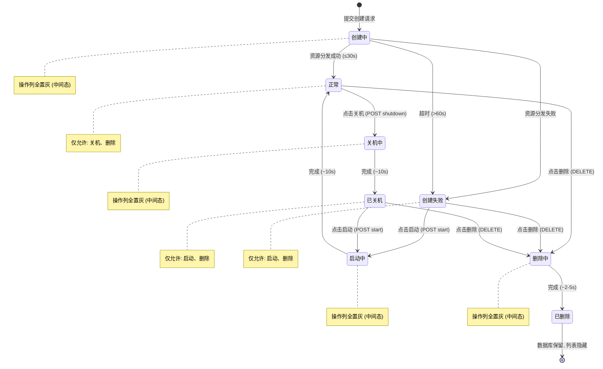

# 测试规格: LECS主机生命周期管理

> **版本**: v1.0.0  
> **创建日期**: 2026-05-09  
> **状态**: 草稿  
> **输入**: 用户描述：007-LECS主机 — LECS主机（云服务器）功能开发：支持在控制台搜索、列表查看、创建、开关机控制及删除操作，前端页面风格与控制台保持一致

**测试类型**: **功能测试** — 本规格覆盖 LECS 主机全生命周期管理的行为验证与结果判定，包括搜索跳转、列表展示与操作矩阵、创建表单校验与提交、状态机流转（关机/开机/删除）、配额管控及异常处理。

---

## 第一章｜模板前置说明

### 【标准模板原文】

本模板是面向"功能测试"的标准规格说明文件（Function Test Specification），用于在需求/设计阶段对功能行为进行结构化定义与验收约束。其定位与约束如下：

1. **模板定位**：属于项目 `constitution.md` 定义体系下的二级测试文档，与性能、安全、可靠性等专项测试 Spec 并列，仅聚焦"功能行为与交互"测试。
2. **使用范围**：适用于新增功能、功能重构、跨模块交互调整等涉及**业务逻辑变更**的测试场景。不适用于纯 UI 美化、文案优化、基础设施升级等非功能变更。
3. **填写规则**：
   - 所有章节均不得留空；不适用的章节应显式填写"无"。
   - 所有表格必须逐行填写完整，不得合并单元格或遗漏必填列。
   - 使用统一的术语与对象命名，确保与需求文档、设计文档、代码命名一致。
   - 图表统一使用 Mermaid 语法绘制，避免引入外部图片或不可编辑图形。
   - 若某章节在编写过程中发现缺失或不适用，必须在本章"填写规则补充"中记录原因并经负责人确认。

### 【针对本特性的填写规则补充】

- **术语统一**：所有文档使用"LECS主机"作为云服务器对象的统一称谓；状态值使用需求规格说明书中定义的 8 种枚举（`creating`、`normal`、`failed`、`shutting_down`、`stopped`、`starting`、`deleting`、`deleted`）。
- **优先级划分**：P0（阻断性问题）> P1（核心功能）> P2（重要功能）> P3（一般功能）。
- **状态流转测试策略**：状态机流转测试（场景 SC-*）为 P0 优先级，覆盖正常流、异常流和边界流。
- **对象命名**：统一使用 `LECSHost` 作为数据模型对象的名称，与后端定义一致。

---

## 第二章｜顶层宪章合规申明

### 【标准模板原文】

本 Spec 严格遵循项目 `constitution.md` 顶层宪章约束，所有测试相关动作必须满足以下法定要求：

1. **需求对齐原则**：本 Spec 所有内容 100% 对齐系统需求 Spec、系统架构 Spec 的功能逻辑、数据模型、交互规则；无本 Spec 依据的测试动作一律禁止，任何超出系统需求 Spec 与系统架构 Spec 范围的"额外测试"不得作为合入或放行依据。
2. **合规刚性原则**：所有测试验收标准完全符合绑定的 RFC 协议规范、行业标准，无合规缺口；验收判定不得以"项目自定义"为由降低或偏离已发布的 RFC/行业强制标准要求。
3. **全量追溯原则**：本 Spec 全生命周期操作可追溯、测试执行全流程数据可追溯、日志可追溯；从 Spec 编制、评审修改、测试执行、验收判定到最终合入，每一环节的操作人、操作时间、操作依据及输出产物均须留痕并可正向/反向查询。

### 【针对本特性的举例】

- **需求对齐示例**：本 Spec 定义的全部状态（`creating`、`normal`、`failed`、`shutting_down`、`stopped`、`starting`、`deleting`、`deleted`）及状态流转路径与需求规格说明书第六章数据流向图完全一致；测试人员不得自行添加"重启"状态流转测试，因为需求明确 v1.0 不包含重启操作。
- **合规刚性示例**：POST/DELETE 接口的 HTTP 状态码校验严格遵循需求定义（创建成功 201、删除成功 202、状态冲突 403/409）；不得因"项目习惯"将错误码含义修改。
- **全量追溯示例**：测试人员执行 SC-09（已关机主机删除）时，必须记录：操作人、执行时间、依据版本（Spec v1.0）、测试结果（通过）、对应 API 请求/响应日志、数据库状态变更记录；后续审计可反向查找到全部执行记录。

---

## 第三章｜核心测试目标

1. **验证控制台搜索跳转**：确保用户在控制台搜索"LECS主机"或"云服务器"后，搜索结果能正确高亮匹配并跳转至列表页（`/console/lecs-hosts/list`）。
2. **验证列表页操作矩阵**：确保 LECS 主机列表页中，每行主机的状态标签渲染正确，操作列按钮（关机/启动/删除）的置灰/可用逻辑 100% 匹配状态机矩阵，已删除主机不在列表中显示。
3. **验证主机创建全流程**：确保创建页六大配置板块（基础配置、实例、操作系统、IP配置、购买时长、费用确认）的表单校验、费用计算、配置确认弹窗、提交创建、异步创建成功/失败流转全部正确。
4. **验证状态机流转**：覆盖 `normal → shutting_down → stopped → starting → normal` 及 `creating → normal/failed`、`stopped/failed → deleting → deleted` 的完整状态机路径，验证异步状态更新耗时与防冲突逻辑。
5. **验证配额与边界管控**：确保 100 台配额限制、超时降级（>60s 创建失败）、并发锁（过渡态按钮全置灰）、网络断连恢复后全量刷新等边界场景正确触发。
6. **验证角色权限隔离**：确保普通用户仅能操作自己的 LECS 主机，管理员可管理所有主机。
7. **回归验证**：本次功能为新增，无需对已有功能进行回归验证。

---

## 第四章｜法定测试范围

### 4.1 功能应用场景定义

| 场景 ID | 场景名称 (类型) | 前置条件 | 触发条件 | 优先级 |
|---------|------------------|----------|----------|--------|
| SC-01   | 控制台搜索匹配"LECS主机"（正常） | 用户已登录控制台 | 在搜索栏输入"LECS"或"云服"或"LECS主机"或"云服务器" | P1 |
| SC-02   | 点击搜索结果跳转列表页（正常） | 搜索结果已高亮显示"LECS主机"条目 | 鼠标点击搜索结果条目 | P1 |
| SC-03   | 列表页加载主机数据（正常） | 用户已登录，存在属于当前用户的 LECS 主机 | 访问 `/console/lecs-hosts/list` | P1 |
| SC-04   | 列表页操作矩阵-正常状态（正常） | 列表中存在状态为 `normal` 的主机 | 查看该行操作列 | P1 |
| SC-05   | 列表页操作矩阵-已关机状态（正常） | 列表中存在状态为 `stopped` 的主机 | 查看该行操作列 | P1 |
| SC-06   | 列表页操作矩阵-创建失败状态（正常） | 列表中存在状态为 `failed` 的主机 | 查看该行操作列 | P1 |
| SC-07   | 列表页操作矩阵-过渡态（删除中）（正常） | 列表中存在状态为 `deleting` 的主机 | 查看该行操作列 | P1 |
| SC-08   | 已删除主机列表隐藏（正常） | 数据库中存在 `deleted` 状态的主机 | 刷新列表页 | P1 |
| SC-09   | 创建页入口正常跳转（正常） | 用户在列表页 | 点击"创建ECS主机"按钮 | P1 |
| SC-10   | 创建页-基础配置校验（异常） | 用户在创建页 | 输入不符合规则的主机名 / 用户名 / 密码 | P1 |
| SC-11   | 创建页-实例规格必选校验（异常） | 用户在创建页，未选择具体规格 | 点击立即购买 | P1 |
| SC-12   | 创建页-手工IP格式校验（异常） | 用户在创建页，选择"手工配置"IP | 输入不符合 IPv4 格式的地址 | P1 |
| SC-13   | 创建页-费用计算-包年/包月（正常） | 用户已选实例规格和购买时长，计费模式为包年/包月 | 查看费用显示栏 | P1 |
| SC-14   | 创建页-费用计算-按需计费（正常） | 用户已选实例规格，计费模式为按需计费 | 查看费用显示栏 | P1 |
| SC-15   | 配置确认弹窗内容完整性（正常） | 用户已填写完整配置并点击"立即购买" | 弹窗弹出 | P1 |
| SC-16   | 配额上限拦截创建（异常） | 用户已有 100 台主机（`deleted_at IS NULL`） | 点击确认弹窗中的"确定" | P1 |
| SC-17   | 提交创建后异步状态流转（正常） | 创建提交成功 | 查看列表页新主机状态 | P0 |
| SC-18   | 正常状态主机关机流转（正常） | 主机状态为 `normal` | 点击操作列"关机"按钮 | P0 |
| SC-19   | 正常状态主机启动流转（正常） | 主机状态为 `stopped` 或 `failed` | 点击操作列"启动"按钮 | P0 |
| SC-20   | 已关机状态主机删除流转（正常） | 主机状态为 `stopped` | 点击操作列"删除"，二次确认 | P0 |
| SC-21   | 创建失败状态主机删除流转（正常） | 主机状态为 `failed` | 点击操作列"删除"，二次确认 | P1 |
| SC-22   | 运行态主机删除拦截（异常） | 主机状态为 `normal` / `creating` / `shutting_down` | 点击或尝试删除 | P1 |
| SC-23   | 过渡态并发锁验证（异常） | 主机处于 `creating` / `shutting_down` / `starting` / `deleting` 中任一状态 | 尝试点击操作列任一按钮 | P1 |
| SC-24   | 创建任务超时降级（异常） | 后台创建任务执行 >60s | 等待超时 | P1 |
| SC-25   | 网络断连后恢复刷新（异常） | 用户在列表页，断网后执行操作再恢复网络 | 网络恢复 | P2 |
| SC-26   | 主机名正则校验-下划线开头（异常） | 用户在创建页 | 主机名输入 `_test123` | P1 |
| SC-27   | 主机名正则校验-超长/超短（异常） | 用户在创建页 | 主机名输入 3 字符或 11 字符 | P1 |
| SC-28   | 凭据复杂度-用户名过短（异常） | 用户在创建页 | 用户名输入 3 字符 | P1 |
| SC-29   | 凭据复杂度-密码过短（异常） | 用户在创建页 | 密码输入 7 字符 | P1 |
| SC-30   | 掩码下拉范围校验（正常） | 用户在创建页，选择"手工配置"IP | 打开掩码下拉框 | P1 |
| SC-31   | 购买时长选择-枚举值（正常） | 用户在创建页 | 选择购买时长 | P1 |
| SC-32   | 配置确认弹窗-取消操作（正常） | 弹窗已弹出 | 点击"取消"按钮 | P2 |
| SC-33   | 完整创建流程端到端（正常） | 用户从列表页进入创建页，完成全流程配置 | 填写全部配置 → 弹窗确认 → 提交 | P0 |
| SC-34   | 完整关机→已关机→启动→正常状态闭环（正常） | 主机状态为 `normal` | 关机 → 等待关机完成 → 启动 → 等待启动完成 | P0 |
| SC-35   | 管理员查看全部主机（正常） | 管理员身份登录 | 访问列表页 | P1 |
| SC-36   | 普通用户权限隔离（正常） | 普通用户 A 登录 | 访问列表页 | P1 |
| SC-37   | 前端 data-testid 覆盖（正常） | 所有页面加载完成 | 检查所有可交互组件 | P1 |

### 4.2 被测对象、属性与属性取值定义

| 编号 | 对象类型 | 对象名称 | 属性名称 | 数据类型 | 合法取值范围/枚举值 | 非法取值范围 | 优先级 |
|------|----------|----------|----------|----------|----------------------|----------------|--------|
| OP-01 | LECS主机 | LECSHost | status | Enum | `creating`, `normal`, `failed`, `shutting_down`, `stopped`, `starting`, `deleting`, `deleted` | 非以上枚举值 | P0 |
| OP-02 | LECS主机 | LECSHost | hostname | String(4-10) | `^[a-zA-Z0-9][a-zA-Z0-9_]{3,9}$`（不含下划线开头） | 空值、下划线开头、<4或>10字符 | P1 |
| OP-03 | LECS主机 | LECSHost | billing_mode | Enum | `包年/包月`, `按需计费` | 非以上枚举 | P1 |
| OP-04 | LECS主机 | LECSHost | instance_type | Enum | `经济型`, `高性能型` | 非以上枚举 | P1 |
| OP-05 | LECS主机 | LECSHost | spec_id | String(UUID) | 实例规格库中存在的有效 UUID | 空值、无效 UUID | P1 |
| OP-06 | LECS主机 | LECSHost | os_image | Enum | `Huawei Euler OS`, `Ubuntu`, `Windows` | 非以上枚举 | P1 |
| OP-07 | LECS主机 | LECSHost | ip_mode | Enum | `DHCP 分配`, `手工配置` | 非以上枚举 | P1 |
| OP-08 | LECS主机 | LECSHost | ip_address | String | 合法 IPv4 格式（如 `192.168.1.1`） | 非法 IP 格式 | P1 |
| OP-09 | LECS主机 | LECSHost | ip_mask | Integer | 8 ~ 24 正整数 | <8 或 >24 | P1 |
| OP-10 | LECS主机 | LECSHost | duration | Integer | 1~9, 12, 24 | 非以上值 | P1 |
| OP-11 | 访问凭据 | Credential | username | String(4-16) | 英文、数字、特殊字符组合，长度4-16 | <4或>16字符 | P1 |
| OP-12 | 访问凭据 | Credential | password | String(8-32) | 英文、数字、特殊字符组合，长度8-32 | <8或>32字符 | P1 |
| OP-13 | 配额 | Quota | host_count | Integer | 0 ~ 100 | >100 | P1 |

### 4.3 测试操作定义

| 编号 | 操作类型 | 操作对象 | 操作动作 | 操作描述 |
|------|----------|----------|----------|----------|
| ACT-01 | 搜索 | 控制台搜索栏 | 输入关键词并查看结果 | 在控制台顶部搜索栏输入"LECS"、"云服"等关键词，验证下拉结果包含"LECS主机"且关键词高亮 |
| ACT-02 | 导航 | 搜索结果条目 | 点击跳转 | 点击搜索结果中的"LECS主机"条目，验证浏览器地址变为 `/console/lecs-hosts/list` 且页面正常加载 |
| ACT-03 | 查询 | LECS主机列表 | 加载列表数据 | 访问列表页路由，验证分页查询返回数据，已删除主机不出现 |
| ACT-04 | 观察 | 操作列按钮 | 查看按钮可用/置灰状态 | 根据主机当前 status 值，逐行检查操作列按钮的 disabled/highlight 状态 |
| ACT-05 | 创建 | LECS主机 | 填写表单提交创建 | 从列表页进入创建页，依次配置基础/实例/OS/IP/时长，点击立即购买，弹窗确认后提交 |
| ACT-06 | 校验 | 表单输入 | 触发实时校验 | 在主机名/用户名/密码/IP 地址输入框中输入非法值，验证红字错误提示 |
| ACT-07 | 控制 | LECS主机 | 点击关机 | 对 `normal` 状态主机点击"关机"，验证状态转为 `shutting_down` 并在最终转为 `stopped` |
| ACT-08 | 控制 | LECS主机 | 点击启动 | 对 `stopped`/`failed` 状态主机点击"启动"，验证状态转为 `starting` 并在最终转为 `normal` |
| ACT-09 | 删除 | LECS主机 | 二次确认后删除 | 对 `stopped`/`failed` 状态主机点击"删除"，弹窗确认后验证状态转为 `deleting`，最终从列表消失 |
| ACT-10 | 验证 | 配额计数 | 创建/删除后检查配额 | 创建成功后配额+1，删除完成后配额-1，已达100时阻止创建 |
| ACT-11 | 验证 | 轮询机制 | 检查列表自动刷新 | 当存在过渡态主机时，验证前端以 3 秒/次轮询，终态后停止 |

### 4.4 功能处理流程定义

**业务主流程图（LECS 主机创建）：**

```mermaid
graph TD
    Start[用户在列表页] --> ClickCreate[点击"创建ECS主机"]
    ClickCreate --> EnterCreate[进入创建页 /console/lecs-hosts/create]
    EnterCreate --> FillBasic[填写基础配置]
    FillBasic --> BasicValid{校验通过?}
    BasicValid -->|否| BasicErr[显示红字错误提示]
    BasicValid -->|是| FillInstance[填写实例配置]
    FillInstance --> InstanceValid{已选规格?}
    InstanceValid -->|否| InstanceErr[提示必选规格]
    InstanceValid -->|是| FillOS[操作系统选择]
    FillOS --> FillIP[IP配置]
    FillIP --> IPValid{IP模式=手工？}
    IPValid -->|是| IPCheck{IP格式正确?}
    IPCheck -->|否| IPErr[提示IP格式错误]
    IPCheck -->|是| FillDuration[选择购买时长]
    IPValid -->|否| FillDuration
    FillDuration --> CalcPrice[费用自动计算]
    CalcPrice --> ClickBuy[点击"立即购买"]
    ClickBuy --> ShowDialog[显示配置确认弹窗]
    ShowDialog --> ClickCancel[点击"取消"]
    ShowDialog --> ClickOK[点击"确定"]
    ClickCancel --> ExitDialog[关闭弹窗，返回创建页]
    ClickOK --> QuotaCheck{配额≤100?}
    QuotaCheck -->|否| QuotaErr[Toast提示"主机数量达到上限"]
    QuotaCheck -->|是| Submit[提交创建请求]
    Submit --> APIResp[API 返回 201, status=creating]
    APIResp --> RedirectList[跳转列表页]
    RedirectList --> Polling[前端轮询状态]
    Polling --> Wait{等待异步任务}
    Wait -->|<30s, 成功| ShowNormal[新主机状态变为 normal]
    Wait -->|<30s, 失败| ShowFailed[新主机状态变为 failed]
    Wait -->|>60s, 超时| ShowTimeout[强制降级为 failed, 停止轮询]
    ShowNormal --> End[流程结束]
    ShowFailed --> End
    ShowTimeout --> End
```

**业务主流程图（LECS 主机关机/启动/删除状态机）：**



**异常分支流程：**

| 分支 ID | 触发节点 | 触发条件 | 处理流程 | 优先级 |
|---------|----------|----------|----------|--------|
| EX-01 | 前端状态机拦截-删除 | 主机状态为 `normal`/`creating`/`shutting_down` 时尝试删除 | 前端直接拦截，Toast 提示"请先将主机关机，再执行删除操作"，不发起网络请求 | P1 |
| EX-02 | 后端状态校验-关机 | 对非 `normal` 状态主机发起 POST shutdown | 后端返回 409 Conflict，前端展示错误信息 | P1 |
| EX-03 | 后端状态校验-启动 | 对非 `stopped`/`failed` 状态主机发起 POST start | 后端返回 409 Conflict，前端展示错误信息 | P1 |
| EX-04 | 后端状态校验-删除 | 对非 `stopped`/`failed` 状态主机发起 DELETE | 后端返回 403 Forbidden，code=NOT_STOPPED，前端展示错误信息 | P1 |
| EX-05 | 并发指令冲突 | 主机处于任一过渡态时用户点击操作列按钮 | 按钮处于 disabled 状态，不发起任何请求 | P1 |
| EX-06 | 创建任务超时 | 后台异步创建任务执行超过 60 秒 | 强制状态降级为 `failed`，前端停止轮询 | P1 |
| EX-07 | 网络断连恢复 | 断网期间用户在列表页执行操作，网络恢复后 | 触发列表页全量刷新（Refetch），确保状态与数据库强一致 | P2 |
| EX-08 | 配额满 | 用户 `deleted_at IS NULL` 记录数 = 100 时提交创建 | 前端拦截并 Toast 提示"主机数量达到上限" | P1 |

---

## 第五章｜功能交互与耦合关系定义

### 5.1 功能交互定义

| 交互ID | 交互类型 | 关系类型 | 交互双方 | 交互接口/协议 | 交互核心内容 | 优先级 |
|--------|----------|----------|----------|---------------|--------------|--------|
| IT-01  | 同步调用 | 依赖 | LECS前端控制台 → 现有认证系统 | JWT Cookie 认证 | Token 验证与权限鉴权 | P0 |
| IT-02  | 同步调用 | 依赖 | LECS前端控制台 → LECS后端API | HTTP REST: GET `/api/v1/lecs-hosts` | 分页查询主机列表（过滤已删除） | P0 |
| IT-03  | 同步调用 | 依赖 | LECS前端控制台 → LECS后端API | HTTP REST: POST `/api/v1/lecs-hosts` | 异步创建主机（含配额校验 ≤100） | P0 |
| IT-04  | 同步调用 | 依赖 | LECS前端控制台 → LECS后端API | HTTP REST: POST `/api/v1/lecs-hosts/{id}/shutdown` | 异步关机指令下发（前置校验 status=normal） | P0 |
| IT-05  | 同步调用 | 依赖 | LECS前端控制台 → LECS后端API | HTTP REST: POST `/api/v1/lecs-hosts/{id}/start` | 异步启动指令下发（前置校验 status=stopped/failed） | P0 |
| IT-06  | 同步调用 | 依赖 | LECS前端控制台 → LECS后端API | HTTP REST: DELETE `/api/v1/lecs-hosts/{id}` | 逻辑删除（前置校验 status=stopped/failed） | P0 |
| IT-07  | 轮询 | 依赖 | LECS前端控制台 → LECS后端API | HTTP REST: GET `/api/v1/lecs-hosts`（3秒/次） | 过渡态主机状态轮询查询 | P1 |
| IT-08  | 异步消息 | 依赖 | LECS后端API → 异步任务队列 (Celery/RQ) | 内部消息队列 | 创建(30s)/关机(10s)/启动(10s)/删除(5s)异步任务投递 | P0 |
| IT-09  | 回调 | 被依赖 | 异步任务队列 → LECS后端API | 内部回调机制 | Worker 执行完成后回调更新状态为终态 | P0 |
| IT-10  | 同步调用 | 依赖 | LECS前端控制台 → 实例规格数据源 | 内部数据接口 | 获取实例规格配置 (vCPU/内存/磁盘/价格) | P1 |
| IT-11  | 同步调用 | 依赖 | LECS前端控制台 → 操作系统镜像数据源 | 内部数据接口 | 获取操作系统镜像列表 | P1 |
| IT-12  | 同步调用 | 依赖 | LECS后端API → 配额系统 | 内部模块调用 | 校验用户主机数量配额 | P1 |
| IT-13  | 同步调用 | 依赖 | LECS后端API → 日志审计系统 | 内部模块调用 | 记录创建/删除/开关机操作日志（操作人、时间、IP、详情） | P1 |

### 5.2 功能耦合关系定义

| 耦合ID | 耦合对象名称 | 耦合类型 | 耦合强度 | 耦合影响范围 | 关系类型 | 测试要求 | 优先级 |
|--------|--------------|----------|----------|--------------|----------|----------|--------|
| CP-01  | 状态机引擎 | 状态共享 | 强耦合 | 关机/启动/删除/创建全部依赖状态机流转规则 | 共享 | 全量状态流转验证 + 并发锁测试 | P0 |
| CP-02  | 配额计数逻辑 | 数据共享 | 强耦合 | 创建需配额+1，删除需配额-1，配额上限100 | 共享 | 配额增减一致性验证 + 上限拦截测试 | P0 |
| CP-03  | 前端轮询调度器 | 时序依赖 | 中耦合 | 过渡态触发轮询，终态停止轮询，频率3秒/次 | 调用 | 轮询启停时序验证 + 频率验证 | P1 |
| CP-04  | 费用计算逻辑（前端） | 代码引用 | 中耦合 | 前端预估费用 = 实例单价 × 时长，与后端实际扣费分离 | 调用 | 前端费用计算准确性验证 | P1 |
| CP-05  | 软删除机制 | 数据共享 | 强耦合 | 删除后 `deleted_at` 有值，数据库保留但列表过滤 | 共享 | 软删除列表隐藏 + 仍计配额验证 | P0 |
| CP-06  | 异步任务队列 | 配置依赖 | 中耦合 | 创建/关机/启动/删除的超时时间(30s/10s/10s/5s)由配置控制 | 被调用 | 超时降级验证 + 异步回调验证 | P0 |

---

## 第六章｜法定不测试范围

本 Spec 仅覆盖"功能行为"测试范畴。以下范围明确排除在本次测试之外，对应的测试职责由专项测试 Spec 覆盖：

1. **性能维度**：包括但不限于列表页加载 ≤2 秒、API 响应时间、并发用户容量、10,000 台主机规模下的查询性能。由《性能测试 Spec》覆盖。
2. **可靠性维度**：包括但不限于网络分区期间状态一致性、消息队列宕机后的重试与降级、长时间轮询的内存泄漏。由《可靠性测试 Spec》覆盖。
3. **安全维度**：包括但不限于 JWT Token 伪造、CSRF 攻击、SQL 注入、XSS、水平越权（用户A操作用户B主机）、密码加密存储验证。由《安全测试 Spec》覆盖。（注：本 Spec 包含**功能级权限隔离**测试——普通用户 vs 管理员可见/操作范围不同，但不涉及安全渗透测试。）
4. **兼容性维度**：包括但不限于跨浏览器（Chrome/Firefox/Safari）渲染差异、平板端/移动端适配。由《兼容性测试 Spec》覆盖。（注：需求明确 v1.0 仅支持桌面端 ≥1280px。）
5. **UI 与视觉维度**：状态标签颜色、按钮置灰样式、页面布局对齐、动效过渡。由 UI/UX 验收规范覆盖。
6. **不包含的功能**：主机重启操作、控制台 VNC 登录、安全组配置、弹性 IP 管理、数据盘挂载、快照备份、批量操作、主机标签管理、区域切换功能。这些均不在 v1.0 范围内，本 Spec 不覆盖。
7. **底层基础设施**：Hypervisor 级别的资源分配/释放、虚拟机启动/关机底层机制。本 Spec 仅验证 API 层指令下发与状态流转结果。

---

## 第七章｜刚性验收标准

### 7.1 被测对象与属性验收标准

- `LECSHost.hostname` 输入不符合正则 `^[a-zA-Z0-9][a-zA-Z0-9_]{3,9}$` 时，必须实时红字提示错误，且不允许提交创建。
- `Credential.username` 长度不在 4-16 区间时，必须实时提示错误并拦截提交。
- `Credential.password` 长度不在 8-32 区间时，必须实时提示错误并拦截提交。
- `LECSHost.ip_address` 选择"手工配置"时，输入不符合合法 IPv4 格式的必须提示错误并拦截提交。
- `LECSHost.ip_mask` 选择"手工配置"时，下拉框可选值必须严格限制在 8-24 的正整数范围内。
- `LECSHost.duration` 必须是 1~9, 12, 24 中的枚举值之一，非法值必须拦截。
- `LECSHost.status` 的任何状态流转必须符合状态机定义，任何非法状态转换必须被前端或后端拦截。

### 7.2 功能场景与处理流程覆盖验收标准

- 全部 37 个测试场景（SC-01 ~ SC-37）必须 100% 执行并输出测试结果，缺一视为验收不通过。
- 状态机完整闭环（`creating → normal → shutting_down → stopped → starting → normal → deleting → deleted`）的主流程与所有异常分支必须验证通过。
- 主流程中"前端提交创建 → API 返回 201 status=creating → 跳转列表页 → 轮询 → 30秒内终态"的顺序必须严格一致；若前端先显示终态但后端任务尚未完成，视为流程不一致 Bug。
- 关机/启动操作的 10 秒异步耗时、删除操作的 2-5 秒异步耗时，必须在可接受的时间窗口内完成状态终态收敛。

### 7.3 功能交互与耦合验收标准

- LECS 前端控制台向 LECS 后端 API 发起的所有生命周期操作（关机/启动/删除）的前置状态校验，必须与后端 API 的校验结果一致；若前端拦截了但后端未拦截（或反之），视为严重 Bug。
- 前端列表页轮询机制：当存在 `creating`/`shutting_down`/`starting`/`deleting` 状态主机时，前端必须启动 3 秒/次的轮询；当所有主机进入终态时，轮询必须停止。
- 配额计数的一致性：创建成功后配额计数必须 +1；删除完成后（数据库 `deleted_at IS NOT NULL`）配额计数必须 -1；100 台满配额时创建必须被阻断。
- 软删除语义：执行删除后，数据库中该主机的 `deleted_at` 字段必须有值（IS NOT NULL），且该行记录在列表页中必须不再显示。
- 操作审计日志：每次创建、删除、关机、启动操作必须记录操作日志，包含操作人 ID、操作时间、操作人 IP、操作详情。

### 7.4 继承性回归验收标准

- 本次为新增功能，无需对已有功能进行回归验证。
- 回归场景 ID 列表：无。

### 7.5 合规验收标准

- 所有 LECS 主机的生命周期操作（创建、删除、关机、启动）必须记录审计日志，包含 `userId`、`timestamp`、`ipAddress`、`operationType`、`hostId`，符合项目审计合规要求。
- 敏感信息（如访问凭据密码、IP 配置）必须在日志中脱敏处理，不得明文输出。
- 用户权限隔离必须符合最小权限原则：普通用户仅能查询/创建/删除/控制自己名下的 LECS 主机；管理员可管理所有主机。测试须验证跨用户操作被正确拒绝。
- 所有 API 接口复用现有 JWT Cookie 认证机制与 CSRF 保护，Token 失效或非法请求必须被拒绝并重定向至登录页。

---

## 第八章｜假设与依赖

### 假设

1. **计费展示**：弹窗预估费用由前端实时计算（实例单价 × 购买时长展示），实际扣费以后端订单为准——测试只验证前端计算展示正确性。
2. **停机计费**：按需模式下，主机"已关机"状态释放计算资源并停止计算计费，但磁盘仍产生费用——创建页需展示此提示，测试验证提示存在。
3. **状态轮询**：前端对过渡态主机的轮询依赖后端 API 的分页查询接口，轮询频率固定为 3 秒/次。
4. **异步任务**：所有异步操作（创建/关机/启动/删除）的超时配置（30s/10s/10s/5s）以配置值为准，测试使用需求中给出的超时值。
5. **认证复用**：JWT Cookie 认证、CSRF 保护、API 限速等安全机制复用现有系统，本 Spec 不测试这些机制的内部实现。
6. **配额计数**：配额统计包含所有 `deleted_at IS NULL` 的记录（即 normal、shutting_down、stopped、failed、creating、starting、deleting 均计入），不包含 `deleted_at IS NOT NULL` 的记录。
7. **初始数据源**：实例规格数据（经济型 4 种规格、高性能型 4 种规格及其价格）和操作系统镜像列表（Huawei Euler OS / Ubuntu / Windows）由内部数据源提供，测试期间数据源可用。

### 外部依赖

| 依赖项 | 类型 | 用途 | 失败处理 |
|--------|------|------|----------|
| 现有认证系统 | 内部模块 | JWT Token 验证 | 未认证/Token 失效时重定向至登录页 |
| 实例规格数据源 | 内部数据 | 提供实例规格配置（vCPU/内存/磁盘/价格） | 加载失败时显示错误提示，禁用提交 |
| 操作系统镜像数据源 | 内部数据 | 提供操作系统镜像列表 | 加载失败时显示错误提示，禁用提交 |
| 配额系统 | 内部模块 | 校验用户主机创建数量上限 | 配额校验失败时 Toast 提示拒绝 |
| 异步任务队列 (Celery/RQ) | 基础设施 | 处理创建/关机/启动/删除异步任务 | 重试或降级为失败状态 |
