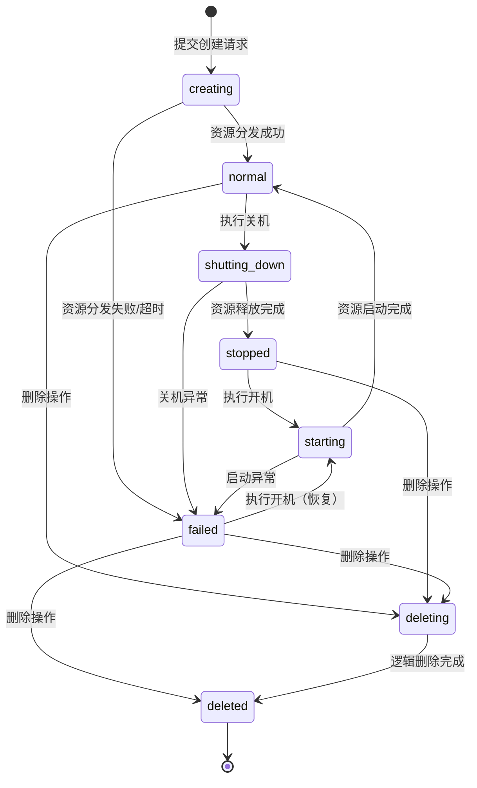

# 测试规格: LECS主机生命周期管理功能

> **测试类型**: 功能测试 (Function Test Specification)  
> **版本**: v1.0.0  
> **创建日期**: 2026-05-09  
> **状态**: Draft  
> **输入**: 需求规格说明书-LECS主机.md (需求编号: 007-LECS主机)  
> **需求描述**: "LECS主机（云服务器）功能开发：支持在控制台搜索、列表查看、创建、开关机控制及删除操作，前端页面风格与控制台保持一致"

---

## 第一章｜模板前置说明

### 【标准模板原文】

本模板是面向"功能测试"的标准规格说明文件（Function Test Specification），用于在需求/设计阶段对功能行为进行结构化定义与验收约束。其定位与约束如下：

1. **模板定位**：属于项目 `constitution.md` 定义体系下的二级测试文档，与性能、安全、可靠性等专项测试 Spec 并列，仅聚焦"功能行为与交互"测试。
2. **使用范围**：适用于新增功能、功能重构、跨模块交互调整等涉及**业务逻辑变更**的测试场景。不适用于纯 UI 美化、文案优化、基础设施升级等非功能变更。
3. **填写规则**：
   - 所有章节均不得留空；不适用的章节应显式填写"无"。
   - 所有表格必须逐行填写完整，不得合并单元格或遗漏必填列。
   - 使用统一的术语与对象命名，确保与需求文档、设计文档、代码命名一致。
   - 图表统一使用 Mermaid 语法绘制，避免引入外部图片或不可编辑图形。
   - 若某章节在编写过程中发现缺失或不适用，必须在本章"填写规则补充"中记录原因并经负责人确认。

### 【举例】

> 以下示例均基于本项目"LECS主机生命周期管理"功能。

- **示例项目**：Lee云平台 LECS 主机（云服务器）管理功能——允许用户在控制台搜索、列表查看、创建、关机、开机、删除云服务器实例。
- **使用范围示例**：适用于"LECS主机创建流程"逻辑调整、状态机流转规则变更、操作列按钮置灰逻辑调整、表单校验规则变更等涉及功能行为变化的场景。
- **不适用场景示例**：仅修改列表页标题字体颜色、调整按钮圆角大小等纯前端 UI 改动不强制使用本模板。
- **填写规则示例**：对象名统一使用需求文档中定义的名称，如 `LECSHost`，而非"云服务器"；状态名统一使用英文枚举值（`normal`、`stopped`、`creating` 等）；优先级统一使用 P0～P4 四级。

---

## 第二章｜顶层宪章合规申明

### 【标准模板原文】

本 Spec 严格遵循项目 `constitution.md` 顶层宪章约束，所有测试相关动作必须满足以下法定要求：

1. **需求对齐原则**：本 Spec 所有内容 100% 对齐系统需求 Spec、系统架构 Spec 的功能逻辑、数据模型、交互规则；无本 Spec 依据的测试动作一律禁止，任何超出系统需求 Spec 与系统架构 Spec 范围的"额外测试"不得作为合入或放行依据。
2. **合规刚性原则**：所有测试验收标准完全符合绑定的 RFC 协议规范、行业标准，无合规缺口；验收判定不得以"项目自定义"为由降低或偏离已发布的 RFC/行业强制标准要求。
3. **全量追溯原则**：本 Spec 全生命周期操作可追溯、测试执行全流程数据可追溯、日志可追溯；从 Spec 编制、评审修改、测试执行、验收判定到最终合入，每一环节的操作人、操作时间、操作依据及输出产物均须留痕并可正向/反向查询。

### 【举例】

> 以下示例均基于"LECS主机生命周期管理"功能。

- **需求对齐示例**："LECS主机状态机"中定义的 `creating` → `normal`、`normal` → `shutting_down` → `stopped` 等状态流转必须与需求规格说明书中第 6.1 节数据流向图完全一致；测试人员不得自行添加需求中未定义的"重启"状态流。
- **合规刚性示例**：DELETE 接口对 `normal` 状态主机的拦截必须返回 403 状态码，不得因"项目习惯"返回 400 或其他状态码。
- **全量追溯示例**：测试人员执行 SC-05（状态机拦截-正常态删除）时，必须在测试管理系统中记录：操作人、执行时间、依据版本（Spec v1.0）、测试结果（通过）、后端返回状态码（403）及响应体（`{"code": "NOT_STOPPED", "message": "..."}`）。

---

## 第三章｜核心测试目标

### 【标准模板原文】

1. **对齐系统定义**：验证被测功能的对象属性、取值、处理流程、交互逻辑 100% 符合系统需求 Spec、系统架构 Spec 的定义，无逻辑偏差、无功能遗漏。
2. **全量场景覆盖**：全量覆盖本次需求的所有功能场景、流程分支、交互耦合场景，无测试盲区。
3. **继承性回归验证**：验证版本迭代的功能变更符合继承性要求，存量功能无劣化、新增功能无缺陷、历史问题无复现。
4. **合规与准入**：确保功能实现完全符合绑定的行业标准、合规规范要求，满足版本上线准入标准。

### 【举例】

> 以下示例均基于"LECS主机生命周期管理"功能。

- **对齐示例**：`LECSHost.status` 的状态枚举值、取值范围、状态流转路径均与需求规格说明书第 4.3 节数据模型和第 6.1 节状态机图完全一致。
- **覆盖示例**：控制台搜索跳转、列表页加载与操作矩阵、主机创建表单校验、开关机生命周期控制、安全删除操作、配额限制、超时降级、并发锁、网络断连恢复等全部场景均已定义并 100% 执行。
- **回归示例**：本次新增 LECS 主机功能后，回归验证控制台全局搜索功能（不影响其他模块搜索结果）、用户认证系统（JWT Cookie 认证复用无异常）。
- **合规示例**：所有操作审计日志字段完整（`userId`、`hostname`、`operationType`、`timestamp`、`ipAddress`），符合项目安全审计要求；API 响应码严格遵循 RESTful 规范（200/201/202/400/403/409/500）。

---

## 第四章｜法定测试范围

### 4.1 功能应用场景定义

| 场景 ID | 场景名称 (类型)              | 前置条件                                       | 触发条件                                       | 优先级 |
|---------|------------------------------|------------------------------------------------|------------------------------------------------|--------|
| SC-01   | 控制台搜索跳转（正常）        | 用户已登录控制台                                 | 用户在顶部搜索栏输入"LECS"或"云服"并点击结果    | P0     |
| SC-02   | 列表页加载与数据渲染（正常）  | 用户拥有至少 1 台 LECS 主机                       | 用户访问 `/console/lecs-hosts/list`             | P0     |
| SC-03   | 空列表展示（正常）            | 用户无 LECS 主机或所有主机已软删除                | 用户访问列表页                                  | P1     |
| SC-04   | 操作列按钮-正常态（正常）     | 主机状态为 `normal`                               | 查看操作列按钮可用性                            | P0     |
| SC-05   | 操作列按钮-已关机态（正常）   | 主机状态为 `stopped`                              | 查看操作列按钮可用性                            | P0     |
| SC-06   | 操作列按钮-创建失败态（正常） | 主机状态为 `failed`                               | 查看操作列按钮可用性                            | P1     |
| SC-07   | 操作列按钮-过渡态置灰（异常） | 主机处于 `creating`/`shutting_down`/`starting`/`deleting` | 查看操作列按钮可用性                    | P0     |
| SC-08   | 主机关机流程（正常）          | 主机状态为 `normal`                               | 用户点击"关机"按钮                              | P0     |
| SC-09   | 主机开机流程（正常）          | 主机状态为 `stopped`                              | 用户点击"启动"按钮                              | P0     |
| SC-10   | 开机流程-从创建失败恢复（正常）| 主机状态为 `failed`                               | 用户点击"启动"按钮                              | P1     |
| SC-11   | 关机流程-超时异常（异常）     | 主机状态为 `normal`，后端 Worker 超时             | 用户点击"关机"按钮后等待 >60s                   | P1     |
| SC-12   | 删除操作-已关机态（正常）     | 主机状态为 `stopped`                              | 用户点击"删除"并二次确认                        | P0     |
| SC-13   | 删除操作-创建失败态（正常）   | 主机状态为 `failed`                               | 用户点击"删除"并二次确认                        | P1     |
| SC-14   | 删除操作-正常态拦截（异常）   | 主机状态为 `normal`                               | 用户点击"删除"按钮                              | P0     |
| SC-15   | 删除操作-过渡态拦截（异常）   | 主机处于 `creating`/`shutting_down`               | 用户点击"删除"按钮                              | P1     |
| SC-16   | 创建主机-完整流程（正常）     | 配额未满（<100），表单合法                         | 用户在列表页点击"创建ECS主机"并完成全流程提交    | P0     |
| SC-17   | 创建主机-主机名校验（异常）   | 用户输入 `_invalid` 或 `ab`（长度不足）            | 用户输入主机名并失焦                            | P1     |
| SC-18   | 创建主机-凭据校验（异常）     | 用户名 <4 字符或密码 <8 字符                       | 用户输入凭据并失焦                              | P1     |
| SC-19   | 创建主机-规格未选（异常）     | 用户未选择具体实例规格                            | 用户点击"立即购买"                              | P1     |
| SC-20   | 创建主机-IP格式校验（异常）   | 手工配置 IP 时输入非法格式（如 `999.999.999.999`） | 用户输入 IP 并失焦                               | P1     |
| SC-21   | 创建主机-配额上限拦截（异常） | 用户已有 100 台主机（`deleted_at IS NULL`）        | 用户提交创建请求                                 | P0     |
| SC-22   | 创建主机-超时降级（异常）     | 后端创建任务超时（>60s）                          | 创建提交后等待 >60s                              | P1     |
| SC-23   | 列表页-软删除隐藏（正常）     | 用户删除一台主机                                  | 刷新列表页                                       | P0     |
| SC-24   | 列表页轮询机制（正常）        | 列表中存在过渡态主机（`creating`/`shutting_down` 等）| 页面加载完成                                    | P1     |
| SC-25   | 网络断连恢复后刷新（异常）    | 断网期间执行操作后网络恢复                        | 网络恢复后                                       | P2     |

### 4.2 被测对象、属性与属性取值定义

| 编号 | 对象类型 | 对象名称 | 属性名称 | 数据类型 | 合法取值范围/枚举值 | 非法取值范围 | 优先级 |
|------|----------|----------|----------|----------|----------------------|----------------|--------|
| OP-01 | LECS主机  | LECSHost | status   | Enum/String | `creating`, `normal`, `failed`, `shutting_down`, `stopped`, `starting`, `deleting`, `deleted` | 非以上枚举值 | P0 |
| OP-02 | LECS主机  | LECSHost | hostname | String(10) | `^[A-Za-z0-9][A-Za-z0-9_]{3,9}$`（4-10字符，非下划线开头） | `_abc`, `ab`, 含特殊字符, >10字符 | P0 |
| OP-03 | LECS主机  | LECSHost | billing_mode | Enum/String | `year_month`（包年/包月）, `on_demand`（按需计费） | 非以上枚举值 | P0 |
| OP-04 | LECS主机  | LECSHost | instance_type | Enum/String | `economy`（经济型）, `high_performance`（高性能型） | 非以上枚举值 | P0 |
| OP-05 | LECS主机  | LECSHost | os_image | Enum/String | `Huawei Euler OS`, `Ubuntu`, `Windows` | 非以上枚举值 | P1 |
| OP-06 | LECS主机  | LECSHost | ip_mode  | Enum/String | `dhcp`, `manual`（手工配置） | 非以上枚举值 | P0 |
| OP-07 | LECS主机  | LECSHost | ip_address | String | 合法 IPv4 格式（如 `192.168.1.100`） | `999.0.0.1`, 空字符串, 非 IP 格式 | P1 |
| OP-08 | LECS主机  | LECSHost | ip_mask  | Integer | 8~24 | <8 或 >24 | P1 |
| OP-09 | LECS主机  | LECSHost | duration | Integer | 1~9, 12, 24 | 0, 10, 11, 13~23, >24 | P0 |
| OP-10 | LECS主机  | LECSHost | username | String(16) | 英文/数字/特殊字符，4-16字符 | <4字符, >16字符 | P0 |
| OP-11 | LECS主机  | LECSHost | password | String(32) | 英文/数字/特殊字符组合，8-32字符 | <8字符, >32字符 | P0 |
| OP-12 | LECS主机  | LECSHost | deleted_at | DateTime/Null | `NULL`（未删除）, 具体日期时间（已删除） | N/A | P0 |

### 4.3 测试操作定义

| 编号 | 操作类型 | 操作对象       | 操作动作                       | 操作描述                                                   |
|------|----------|----------------|--------------------------------|------------------------------------------------------------|
| ACT-01 | 查询    | LECSHost       | 搜索并跳转                     | 在控制台顶部搜索栏输入关键词，点击搜索结果跳转至列表页      |
| ACT-02 | 查询    | LECSHost       | 加载列表数据                   | 访问列表页路由，验证数据表格渲染与操作列显示                |
| ACT-03 | 查询    | LECSHost       | 查看操作列按钮状态              | 针对不同状态主机，验证"关机"/"启动"/"删除"按钮置灰/可用逻辑  |
| ACT-04 | 更新    | LECSHost       | 执行关机操作                   | 点击"关机"按钮，验证状态变更为 `shutting_down` → `stopped`   |
| ACT-05 | 更新    | LECSHost       | 执行开机操作                   | 点击"启动"按钮，验证状态变更为 `starting` → `normal`         |
| ACT-06 | 删除    | LECSHost       | 执行删除操作                   | 点击"删除"按钮，二次确认后验证状态变更为 `deleting` → 消失   |
| ACT-07 | 创建    | LECSHost       | 填写表单并提交                 | 在创建页完成六大板块配置，点击"立即购买"弹窗确认后提交       |
| ACT-08 | 校验    | LECSHost       | 表单输入校验                   | 输入非法值（主机名/凭据/IP/规格），验证实时红字错误提示       |
| ACT-09 | 查询    | LECSHost       | 触发列表轮询                  | 列表中存在过渡态主机时，验证 3 秒/次轮询机制                  |
| ACT-10 | 查询    | LECSHost       | 网络断连恢复后刷新             | 断网操作后恢复网络，验证列表全量刷新                          |

### 4.4 功能处理流程定义

**业务主流程图（创建流程）：**

```mermaid
graph TD
    Start[用户点击创建ECS主机] --> Route[跳转 /console/lecs-hosts/create]
    Route --> FillForm[填写六大板块配置]
    FillForm --> Validate{表单校验通过?}
    Validate -->|否| ShowError[实时红字提示错误]
    Validate -->|是| QuotaCheck{配额 <= 100?}
    QuotaCheck -->|否| QuotaErr[Toast提示"主机数量达到上限"]
    QuotaCheck -->|是| Dialog[弹出配置确认弹窗]
    Dialog --> Confirm{点击确定?}
    Confirm -->|取消| Cancel[返回创建页]
    Confirm -->|提交| Submit[POST /api/v1/lecs-hosts]
    Submit --> Response[返回 201, 状态 creating]
    Response --> Redirect[跳转列表页]
    Redirect --> End[流程结束]
```

**业务主流程图（关机流程）：**

```mermaid
graph TD
    Start[主机状态 normal] --> ClickShutdown[用户点击"关机"]
    ClickShutdown --> StateCheck{状态 == normal?}
    StateCheck -->|否| Reject[前端拦截，不发起请求]
    StateCheck -->|是| API[POST /api/v1/lecs-hosts/{id}/shutdown]
    API --> TransState[状态变为 shutting_down]
    TransState --> Worker[后台 Worker 执行资源释放 ~10s]
    Worker --> FinalState[状态变为 stopped]
    FinalState --> Update[列表按钮更新: 关机置灰/启动可用]
    Update --> End[流程结束]
```

**异常分支流程：**

| 分支 ID | 触发节点       | 触发条件                          | 处理流程                                          | 优先级 |
|---------|----------------|-----------------------------------|---------------------------------------------------|--------|
| EX-01   | 关机操作       | 主机状态非 `normal`               | 前端拦截，关机按钮置灰，不发起请求                | P0     |
| EX-02   | 开机操作       | 主机状态非 `stopped`/`failed`      | 前端拦截，启动按钮置灰，不发起请求                | P0     |
| EX-03   | 删除操作       | 主机状态非 `stopped`/`failed`      | 前端拦截，提示"请先将主机关机，再执行删除操作"    | P0     |
| EX-04   | 删除操作       | 后端校验状态不符                   | 返回 403 `{code: "NOT_STOPPED"}`                  | P0     |
| EX-05   | 创建操作       | 用户配额已达 100 台                | 拦截并 Toast 提示"主机数量达到上限"               | P0     |
| EX-06   | 创建操作       | 后端超时 >60s                      | 状态降级为 `failed`，停止前端轮询                 | P1     |
| EX-07   | 所有操作       | 主机处于过渡态                     | 操作列所有按钮置灰，禁止点击                     | P0     |
| EX-08   | 网络操作       | 断网期间发起请求                   | 网络恢复后触发列表全量刷新                        | P2     |

**核心状态机（以 LECSHost 为例）：**



---

## 第五章｜功能交互与耦合关系定义

### 5.1 功能交互定义

| 交互ID | 交互类型 | 关系类型 | 交互双方 | 交互接口/协议 | 交互核心内容 | 优先级 |
|--------|----------|----------|----------|---------------|--------------|--------|
| IT-01  | 同步调用 | 依赖     | 前端控制台 → LECS 主机 API 服务   | HTTP REST: GET /api/v1/lecs-hosts | 分页查询主机列表 | P0     |
| IT-02  | 同步调用 | 依赖     | 前端控制台 → LECS 主机 API 服务   | HTTP REST: POST /api/v1/lecs-hosts | 创建主机（异步任务下发） | P0     |
| IT-03  | 同步调用 | 依赖     | 前端控制台 → LECS 主机 API 服务   | HTTP REST: POST /api/v1/lecs-hosts/{id}/shutdown | 关机指令下发 | P0     |
| IT-04  | 同步调用 | 依赖     | 前端控制台 → LECS 主机 API 服务   | HTTP REST: POST /api/v1/lecs-hosts/{id}/start | 开机指令下发 | P0     |
| IT-05  | 同步调用 | 依赖     | 前端控制台 → LECS 主机 API 服务   | HTTP REST: DELETE /api/v1/lecs-hosts/{id} | 逻辑删除请求 | P0     |
| IT-06  | 轮询     | 依赖     | 前端控制台 → LECS 主机 API 服务   | HTTP REST: GET /api/v1/lecs-hosts | 过渡态列表轮询 (3s/次) | P1     |
| IT-07  | 同步调用 | 依赖     | LECS 主机 API 服务 → 配额系统     | 内部 API: POST /validate-quota | 创建前配额校验（≤100） | P0     |
| IT-08  | 异步消息 | 依赖     | LECS 主机 API 服务 → 异步任务队列 | Celery/RQ: 创建/关机/开机/删除任务 | Worker 异步执行与状态回调 | P0     |
| IT-09  | 同步调用 | 依赖     | 前端控制台 → 全局搜索服务         | 内部 API: GET /search?q=LECS | 控制台搜索结果匹配 | P1     |
| IT-10  | 同步调用 | 依赖     | LECS 主机 API 服务 → 认证系统     | JWT Cookie 验证 | Token 校验与用户身份识别 | P0     |
| IT-11  | 异步消息 | 被依赖   | LECS 主机 API 服务 → 审计日志系统 | 内部 API: POST /audit-log | 记录操作日志（人/时间/IP/详情） | P1     |

### 5.2 功能耦合关系定义

| 耦合ID | 耦合对象名称       | 耦合类型 | 耦合强度 | 耦合影响范围                                                     | 关系类型 | 测试要求                           | 优先级 |
|--------|--------------------|----------|----------|------------------------------------------------------------------|----------|------------------------------------|--------|
| CP-01  | StatusMatrix       | 代码引用 | 强耦合   | 状态机矩阵控制操作列按钮置灰逻辑，影响所有生命周期操作             | 调用     | 全量状态-按钮组合验证测试          | P0     |
| CP-02  | FormValidator      | 代码引用 | 强耦合   | 表单校验规则影响主机创建成功率，涉及 hostname/credentials/IP 校验  | 调用     | 边界值/等价类校验测试              | P0     |
| CP-03  | PollingManager     | 代码引用 | 中耦合   | 列表轮询机制与状态判断耦合，影响前端性能与状态同步                 | 调用     | 轮询启停触发条件测试               | P1     |
| CP-04  | QuotaChecker       | 数据共享 | 中耦合   | 配额统计逻辑依赖 `deleted_at IS NULL` 条件，影响创建拦截           | 共享     | 配额边界值（99/100/101）测试       | P0     |
| CP-05  | AsyncWorker        | 配置依赖 | 中耦合   | Worker 执行耗时影响状态流转（创建 30s/关机 10s/删除 5s）          | 被调用   | 异步超时/降级测试                  | P1     |
| CP-06  | CostCalculator     | 代码引用 | 弱耦合   | 前端费用计算逻辑（单价×时长），影响弹窗展示金额                   | 调用     | 费用计算准确性测试                 | P1     |

---

## 第六章｜法定不测试范围

本 Spec 仅覆盖"功能行为"测试范畴。以下范围明确排除在本次测试之外，对应的测试职责由专项测试 Spec 覆盖：

1. **性能维度**：包括但不限于列表页加载时间 <2s、接口响应时间、95% 请求 <1s 等指标。由《性能测试 Spec》覆盖（注：需求"成功标准 1/2/3"中的时间指标需性能测试专项验证）。
2. **可靠性维度**：包括但不限于异步任务队列故障恢复、Worker 长时间运行稳定性、数据库主备切换。由《可靠性测试 Spec》覆盖。
3. **安全维度**：包括但不限于越权访问（操作用户主机）、JWT Token 伪造、CSRF 攻击、SQL 注入、敏感数据泄露。由《安全测试 Spec》覆盖（注：需求 5.4 节安全要求需安全测试专项验证）。
4. **兼容性维度**：包括但不限于浏览器兼容性（Chrome/Firefox/Edge）、屏幕分辨率适配。由《兼容性测试 Spec》覆盖（注：需求 3.4 节明确 v1.0 仅支持 1280px+ 桌面端）。
5. **UI 与视觉维度**：颜色、字体、布局、动效、图标等前端视觉表现。由 UI/UX 验收规范覆盖（如状态标签颜色、按钮置灰样式）。
6. **不包含功能**：主机重启操作、控制台 VNC 登录、安全组配置、弹性 IP 管理、数据盘挂载、快照备份、批量操作、主机标签管理、区域切换功能（需求 1.3 节明确排除）。

---

## 第七章｜刚性验收标准

### 7.1 被测对象与属性验收标准

- `LECSHost.hostname` 输入 `_invalid`（下划线开头）时，必须实时提示错误并阻止提交。
- `LECSHost.hostname` 输入 `ab`（长度 <4）时，必须实时提示错误并阻止提交。
- `LECSHost.password` 输入 `12345`（长度 <8）时，必须实时提示错误并阻止提交。
- `LECSHost.ip_address` 输入 `999.999.999.999`（非法格式）时，必须提示错误并阻止提交。
- `LECSHost.ip_mask` 输入 7 或 25（超出 8~24 范围）时，必须拦截非法值。
- `LECSHost.duration` 输入 0、10、11、13~23、>24 时，必须拦截非法值。
- `LECSHost.status` 在任何异步操作后，必须最终收敛为定义的状态机终态（`normal`/`stopped`/`failed`/`deleted`），不得卡在过渡态。

### 7.2 功能场景与处理流程覆盖验收标准

- 全部 25 个测试场景（SC-01~SC-25）必须 100% 执行并输出测试报告；缺少任一场景视为验收不通过。
- 状态机主流程（`creating` → `normal` → `shutting_down` → `stopped` → `starting` → `normal`）中的每个节点行为必须与 Spec 定义一致。
- 前端轮询机制必须在列表中存在过渡态主机时自动启动（3 秒/次），所有主机变为终态后自动停止。
- 关机/开机/删除操作的异步流转必须先写过渡态（`shutting_down`/`starting`/`deleting`），Worker 执行完成后回调更新为终态。若前端跳过过渡态直接变为终态，视为流程不一致。

### 7.3 功能交互与耦合验收标准

- 前端提交删除请求后，后端必须校验主机状态（`stopped`/`failed`），若状态不符必须返回 403 且响应体包含 `{"code": "NOT_STOPPED"}`。
- 当同一主机同时发起关机和删除请求（并发冲突），必须采用串行化处理或拒绝后发请求，不得导致状态异常。
- 配额校验必须统计所有 `deleted_at IS NULL` 的记录（含 `normal`/`stopped`/`failed`/`creating`/`shutting_down`/`starting`/`deleting`），达到 100 台时必须阻断创建。
- 前端 `data-testid` 属性必须 100% 覆盖需求 3.2 节定义的所有可交互组件（列表页 6 项 + 创建页 16 项）。

### 7.4 继承性回归验收标准

- 因本次新增 LECS 主机功能，需回归验证以下历史功能：
  - "控制台全局搜索"（不影响其他模块搜索结果返回）
  - "用户认证系统"（JWT Cookie 认证复用无异常，未登录跳转登录页）
- 回归场景 ID 列表：SC-01（搜索跳转依赖全局搜索功能）、所有 API 接口（依赖认证系统）。

### 7.5 合规验收标准

- 所有 LECS 主机的创建、删除、开机、关机操作必须写入审计日志，包含 `userId`、`hostname`、`operationType`、`timestamp`、`ipAddress`，不可遗漏。
- 密码必须哈希存储（不得明文），日志中不得输出密码原文。
- 软删除后的主机（`deleted_at IS NOT NULL`）不得出现在列表页，但数据库中保留记录。
- 删除操作的配额释放（计数 -1）必须在逻辑删除完成后同步生效。

---

## 第八章｜测试环境要求

### 8.1 前置条件

- 测试环境需部署完整的 LECS 主机 API 服务（含异步任务队列 Worker）。
- 测试用户需已注册并完成认证，JWT Cookie Token 有效。
- 测试环境数据库可执行手动 SQL 注入测试数据（不同状态主机记录）。
- 网络环境稳定，可模拟断网/恢复场景（如 Chrome DevTools Network 节流）。

### 8.2 测试数据准备

| 数据项 | 数量 | 说明 |
|--------|------|------|
| 正常态主机 | 3 台 | 用于测试关机、删除拦截 |
| 已关机态主机 | 2 台 | 用于测试开机、删除 |
| 创建失败态主机 | 1 台 | 用于测试开机、删除 |
| 过渡态主机 | 1 台/状态 | `creating`/`shutting_down`/`starting`/`deleting` 各 1 台 |
| 空数据用户 | 1 个 | 用于测试空列表展示 |
| 满配额用户 | 1 个 | 已有 100 台主机（`deleted_at IS NULL`） |

---

## 第九章｜假设与约束

1. **假设**：异步任务队列（Celery/RQ）正常运行，Worker 可正常消费任务。若 Worker 故障，测试降级为状态流转超时场景验证。
2. **假设**：计费逻辑由后端计算并返回，前端仅做展示。测试聚焦于前端表单费用计算（单价×时长）的准确性。
3. **约束**：v1.0 仅支持"关机/启动"，暂不支持"重启"。测试不覆盖任何"重启"相关路径。
4. **约束**：测试环境不连接真实 Hypervisor，关机/开机/创建的后台执行通过 Mock Worker 模拟耗时。
5. **假设**：实例规格数据源和操作系统镜像数据源正常可用。若数据源加载失败，创建页禁用提交按钮（测试需验证此降级行为）。
6. **约束**：配额上限为 100 台，该阈值由后端配置控制，测试不得修改该阈值。
